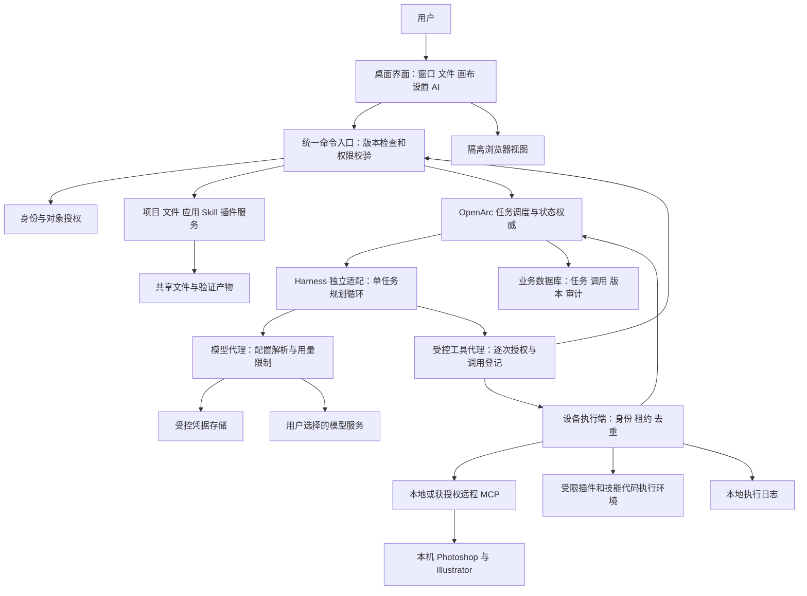
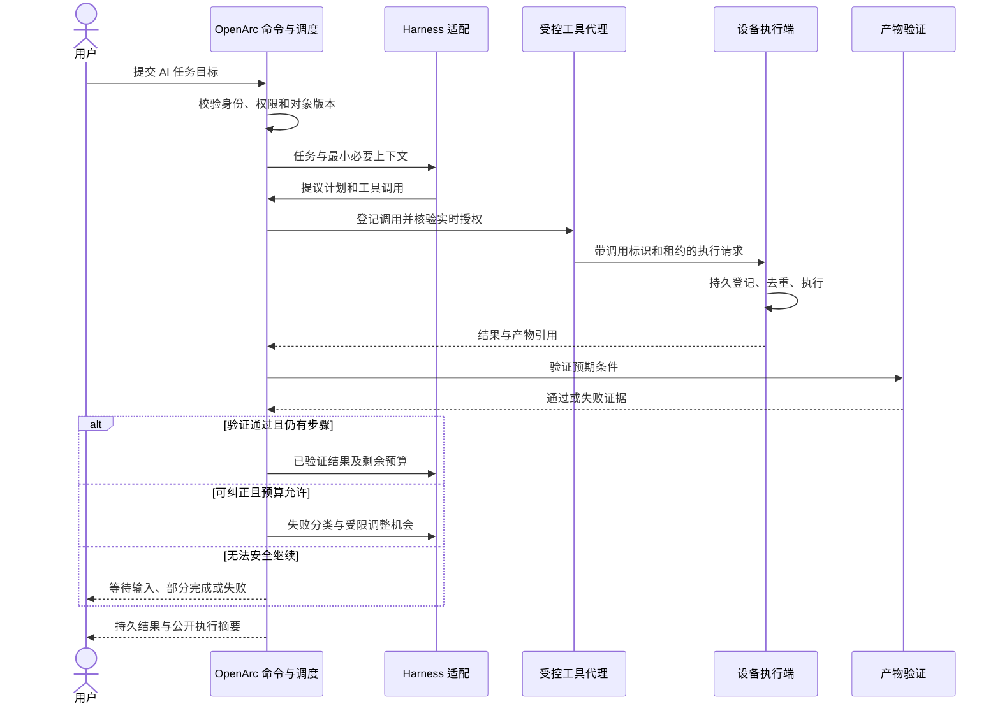
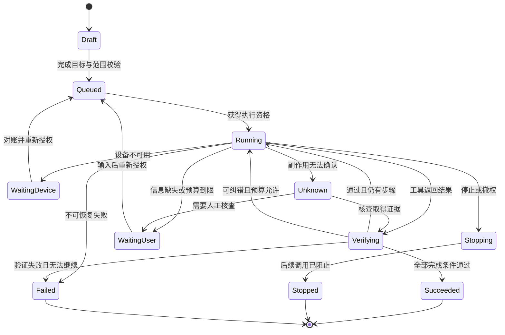

# OpenArc OS 详细实施计划

更新日期：2026-09-10。本文是实施方案，不代表功能已开发或接入已验证。用户已授权按计划实施，当前进入 D1 技术验证；实际完成情况以 PROGRESS.md 和验证证据为准。

配套规范：[设计语言系统](DESIGN_SYSTEM.md)和[交互动效系统](MOTION_SYSTEM.md)。两份文件是全局实施依据，具体参数仍需原型和实机验证。

阅读导航：先看第 37—40 节的整体架构、三张图、AI 闭环与完整实例；第 31—32 节是任务级执行与验收；第 21—30 节是页面、权限、数据与接口细则；第 1—20 节保留产品基线，第 41 节列新增闭环关卡。

## 1. 目标与完成标准

OpenArc OS 是运行在 Windows/macOS 上的完整独立桌面系统，依赖宿主系统运行，不开发操作系统内核。
它提供登录、桌面、窗口、文件、应用、设置、账号和局域网协作，AI 可以在授权范围内统一操作这些能力。
产品不能收缩成聊天窗口加应用入口；日常工作可以通过鼠标完成，也可以交给 AI 完成。
首版完成意味着完整桌面工作流程及全部首版模块通过验收；至少一条 AI 到真实工具的纵向流程只作为早期冒烟验证，不能代替 Photoshop、Illustrator 分别验证及完整首版验收。
界面演示、模拟数据与真实功能分别标注，不用入口数量或动画数量代替功能验收。

## 2. 已确认与待验证

已确认：Apple 半透明磨砂玻璃界面，组件和交互动效沿用 [Spectrum UI](https://ui.spectrumhq.in/) 的参考方向。
已确认：浏览器、无限画布、文件管理、Adobe Photoshop 和 Illustrator 应用入口、MCP、插件、Skill 市场和自定义 Skill。
已确认：局域网内部账号管理、资源共享、设备协作和任务分配。
已确认：设置中统一管理自定义 API、模型和能力默认值，接入应用继承有效配置。
已确认：内核 AI 指后端助手运行框架，不等同于某一个大模型。
优先验证：[DeepSeek Harness](https://www.deepseek.com/harness/)；其开发者预览状态、接口和运行要求需要实际核验。
待验证：首个交付平台、Adobe 可用版本、具体 MCP 来源、Spectrum 组件适配和平台打包条件。
待验证不等于取消范围；若证据表明必须改变产品方向或删减功能，向用户说明后再决定。

## 3. 系统组成与职责

桌面客户端负责显示工作环境、窗口、应用、文件和任务状态。
局域网中心服务负责身份、权限、项目、团队设置、任务协调和共享资源。
每台参与执行的电脑运行设备执行端，负责本机应用启动、文件访问和本机工具调用。
AI 运行框架负责规划和持续执行任务，通过独立适配层接入 OpenArc OS。
统一模型服务负责解析个人及团队配置、保管凭据、调用模型并记录用量。
所有执行请求经过 OpenArc OS 权限检查，不由模型自行决定是否有权访问资源。
中心服务与设备执行端分别显示健康状态，中心在线不代表所有设备都能执行。

## 4. 全局视觉与动效规范

桌面、应用栏、窗口边框、菜单、抽屉和通知使用背景模糊、细边框、柔和阴影与分层透明度。
文本、表格、画布编辑区保持清晰，不让透明背景妨碍阅读或精确编辑。
先形成颜色、字体、间距、圆角、透明度、阴影、窗口层级和图标规范，再制作页面。
提供浅色和深色方案，并验证不同壁纸上的对比度。
动效统一覆盖窗口打开、关闭、最小化、恢复、应用栏悬停、菜单展开和页面切换。
AI 排队、执行、等待输入、成功与失败使用一致的状态反馈，不依赖颜色单独传意。
Spectrum 组件需逐项核对实际代码、许可和依赖，不假定整个站点可以直接复制使用。
组件映射采用 Command Search 对应全局搜索、Animated Drawer 对应侧栏、Dynamic Island 对应任务状态、Toast Stack 对应通知、Tree Nav 对应文件导航、Animated Switch 对应设置开关；商用许可尚未核验。
动效可中断，快速重复操作不叠加残影或阻塞点击。
支持减少动态效果设置；降低动画强度后仍保留完整状态信息。
玻璃效果有性能降级方案，低性能设备可以降低模糊强度。
统一检查键盘焦点、快捷键、缩放、中文长文本和窗口窄宽状态。

## 5. 页面与工作区域清单

| 区域 | 必须具备的内容 |
| --- | --- |
| 登录与加入团队 | 登录、服务地址、加入设备、连接错误和会话失效 |
| 桌面 | 壁纸、应用栏、桌面入口、窗口、通知、全局搜索 |
| 文件管理 | 个人与项目文件、路径、预览、搜索、操作和归属提示 |
| 应用中心 | 已安装、可安装、详情、启动、版本、启停与连接状态 |
| 浏览器 | 标签页、地址栏、前进后退、刷新、下载与外链处理 |
| 无限画布 | 项目、画布、内容块、连线、缩放、保存与资源引用 |
| 全局 AI | 会话、任务、目标设备、步骤、结果、停止和失败详情 |
| MCP 中心 | 连接配置、授权、工具列表、状态和调用记录 |
| Skill 中心 | 市场、我的技能、团队技能、编辑、版本和试运行 |
| 插件中心 | 安装、来源、权限、版本、启停和异常状态 |
| 设置 | 外观、模型 API、连接凭据、账号、团队、设备和存储 |
| 团队管理 | 成员、角色、项目访问、设备授权和共享发布权限 |

## 6. 桌面、窗口与应用生命周期

桌面支持启动应用、切换窗口、最小化、恢复、最大化、关闭和窗口前后层级。
窗口记录尺寸与位置，恢复时适配当前屏幕，避免出现在屏幕之外。
区分关闭窗口与退出应用；未保存内容提供明确处理入口。
应用至少具备未安装、安装中、可用、运行中、已停用、更新中和错误状态。
启动失败展示原因与重试入口，不能只让图标一直旋转。
应用更新时处理运行任务与未保存内容，不直接销毁用户工作。
内置应用在 OpenArc 窗口中运行；外部 Adobe 应用保持原生窗口。
统一搜索可定位应用、文件、设置和可用 Skill，并按用户权限过滤结果。
系统通知能回到对应任务、文件或应用，避免出现无法追踪的提示。

## 7. 文件与无限画布

文件区分个人文件、团队项目文件与设备本机文件，显示归属及存储位置。
中心服务保存共享文件元数据；文件本体的中心存储与本机引用规则在技术验证阶段确定。
本机路径不能直接当作另一台设备上的可用文件，跨设备使用需明确上传或传输。
支持创建、导入、预览、重命名、移动和删除；删除与覆盖遵守权限及恢复策略。
同名文件和覆盖操作有明确冲突处理，不默默覆盖他人成果。
无限画布支持拖拽、平移、缩放、内容块、连线、选择、撤销和保存。
首版内容块覆盖文本、图片、文件引用及 AI 生成结果，保留来源与任务关联。
保存采用版本检查；两人修改同一文档时提示冲突并保留可恢复副本。
首版团队可共享画布文件，多人同时实时编辑作为后续扩展，不能用覆盖保存伪装实时协作。
画布重新打开后，节点位置、连线和资源引用保持一致。

## 8. 真实桌面浏览器

浏览器采用桌面容器提供的真实浏览器视图，不用任意网站 iframe 拼成浏览器。
建议验证 Electron [WebContentsView](https://www.electronjs.org/docs/latest/api/web-contents-view)，并按 [官方安全说明](https://www.electronjs.org/docs/latest/tutorial/security)检查网页隔离与系统桥接边界。
支持真实网址导航、标签切换、页面加载状态、下载和基本会话保存。
网页运行环境与桌面系统权限隔离，网页不能直接访问执行端或系统凭据。
处理弹窗、外部协议、证书错误、文件上传下载和权限申请。
团队共享项目不等于共享浏览器登录态；会话数据按用户隔离。
AI 控制浏览器须通过明确工具与授权，记录目标标签和执行结果。
复杂登录、企业认证、媒体播放与特定网站兼容性通过实测确认，不承诺全部网站一致支持。

## 9. 统一 API 与模型配置

设置集中管理供应商、API 地址、凭据、自定义模型、能力类型和连接测试。
按对话、工具调用、图像、视频等能力配置默认模型，不按名字猜测能力。
有效配置顺序为个人配置优先，其次是该用户获授权使用的团队默认配置。
没有可用配置时展示缺失原因，不回退到其他用户的密钥。
个人修改只影响本人；管理员修改团队默认值不覆盖已有个人配置。
新任务采用新配置；运行中任务保留启动时配置版本，避免执行过程切换模型。
配置快照不保留已撤销的权限；模型或工具授权撤销后立即阻止运行任务的新调用，并尽可能取消正在执行的请求，已发生的副作用据实记录。
密钥保存在后端凭据设施或系统凭据库，前端仅显示脱敏信息。
插件和接入应用通过后端调用，不接收原始模型密钥。
自定义地址必须匹配支持协议，并验证地址可达、授权有效和所需能力。
日志、导出文件、Skill 包及错误消息不得包含凭据。
统一 API 不替代 Adobe 账号许可、MCP OAuth 或其他服务自己的授权。

## 10. AI 运行框架与 Harness 适配

先验证 Harness 的启动、会话、任务执行、工具调用、技能加载、取消和存储能力。
只依据已查证的实际接口设计适配，不虚构 SDK、字段或内置功能。
OpenArc OS 定义自己的任务和权限边界，框架实现放在独立适配模块中。
适配层转换模型配置、会话事件、工具请求和结果，避免页面直接依赖框架内部结构。
若 Harness 缺少能力，记录具体缺口与补齐方案，不假定团队隔离已由框架提供。
工具调用先校验用户、对象、设备和连接权限，再交给执行端。
任务中的工具描述、网页和 Skill 内容视为输入，不能改变用户权限。
中止阻止后续步骤；已发生副作用只在工具明确支持撤销时提供撤销。
框架升级须经过兼容验证，保留可替换实现，不让预览版变化阻断整个桌面。

## 11. MCP 与 Adobe 应用

MCP 中心管理本地进程和远程服务连接，并清楚标注执行位置。
实现遵循已核验的 [MCP 架构说明](https://modelcontextprotocol.io/docs/learn/architecture)，具体能力仍以服务实际协商和发现结果为准。
按服务实际支持方式处理 OAuth、其他凭据和无需授权的连接，不假设统一授权流程。
连接后发现工具和能力，记录版本及状态；工具变化时更新可用能力提示。
支持测试、重连、启停、凭据更新和连接删除，执行中的调用有明确处理规则。
本地服务在对应设备执行端运行，中心服务不直接猜测或访问成员电脑路径。
按连接、工具与设备控制调用权限，授权失效时立即阻止新调用。
[Illustrator 官方说明](https://helpx.adobe.com/in/illustrator/desktop/connect-with-other-apps-and-tools/about-using-ai-tools-with-illustrator.html)介绍 Beta 内置 MCP，具体能力以目标版本实测为准。
[Photoshop 社区实现](https://github.com/marcoz93/photoshop-mcp)作为候选，目前未验证连接或版本兼容。
[魔搭 MCP 市场](https://modelscope.cn/mcp)作为来源候选，具体 Adobe 条目、安装条件与来源需要核验。
Adobe 验收包含启动原生应用、发现实际工具、修改测试文档并检查真实结果。
工具有副作用时使用调用标识去重；结果未知时先核查实际状态，不能盲目重试。

## 12. Skill 市场与自定义 Skill

市场提供分类、搜索、详情、依赖说明、版本、安装、卸载和更新。
首版采用受管理目录并支持团队发布，不提前实现公开付费交易。
技能包以 SKILL.md 为核心，配套资源、模板或脚本按明确目录规则组织。
核心格式遵循 [Agent Skills 规范](https://agentskills.io/specification)，OpenArc 的安装状态、权限和团队分享等元数据单独存储，保持技能包兼容。
安装前展示来源、用途、依赖和请求权限；安装动作不会自动授权工具或设备。
编辑器支持名称、说明、步骤、资源文件和版本内容编辑。
导入校验格式、路径与大小，阻止越界写入；导出不包含密钥和私人会话。
每次发布生成可识别版本，保留更新说明、旧版本和回退能力。
启停影响新任务；运行中任务固定原版本，并在界面说明其状态。
试运行先检查模型、应用、MCP、资源和权限，展示执行记录与结果。
个人技能默认私有，分享到团队需要明确范围，团队发布按角色权限控制。
共享 Skill 不共享作者的凭据、设备权限或文件访问权。
带脚本的 Skill 使用受控执行环境，不因为来自市场就获得任意本机权限。

## 13. 插件隔离与扩展

插件提供额外应用界面或功能，MCP 提供工具，Skill 组织步骤，三者分别管理。
插件声明身份、版本、入口和权限，通过受控桥接接口访问系统能力。
插件界面与桌面主界面隔离，不能读取宿主文件、其他插件数据或原始凭据。
安装、更新、启停、卸载和异常恢复均有可见状态。
卸载前说明数据保留规则，不能因卸载插件误删共享项目文件。
首版完成基础插件生命周期和权限边界；更广泛第三方生态后续开放。

## 14. 局域网账号、设备与对象权限

中心服务统一账号与会话，首版至少提供管理员和成员角色。
管理员管理成员、设备加入、项目访问、团队配置和技能发布权限。
对象权限覆盖项目、文件、画布、模型配置、连接、技能、插件和执行设备。
前端隐藏入口仅用于体验，后端每次读取与执行都重新检查权限。
设备加入需建立可信身份，离开团队或撤销授权后不能继续领取新任务。
任务明确记录发起者、所属项目、执行账号和目标设备，不自动借用管理员身份。
设备离线时任务显示等待设备或中断，不能悄悄切换至其他电脑。
网络恢复后核对执行记录，避免重复创建文件、重复提交或重复修改文档。
共享资源采用版本或锁定机制处理并发；冲突必须可见且保留用户内容。
中心备份覆盖账号、权限、项目元数据和共享内容，凭据使用独立安全恢复方式。

## 15. 核心数据与任务状态

核心实体：用户、团队、成员关系、设备、项目、文件、画布、应用安装和插件安装。
配置实体：模型供应商、配置版本、凭据引用、MCP 连接、工具目录、Skill 与 Skill 版本。
执行实体：会话、任务、步骤、工具调用、执行租约、结果文件和审计事件。
每个资源记录归属、创建者、版本及时间；凭据仅保存引用，不混入普通任务内容。
任务状态：草稿、排队、执行中、等待用户、等待设备、停止中、已停止、成功和失败。
工具调用另设结果未知状态，用于断线或超时后无法确认副作用的情况。
状态转换由服务校验，不能让客户端直接把失败任务改为成功。
重试建立清楚的关联记录，保留原始失败原因、调用标识和恢复依据。

## 16. 建议技术路线与决策点

桌面建议 Electron + React + TypeScript，便于真实浏览器视图、多窗口及组件适配；尚未安装或实测。
页面、桌面桥接、中心服务、设备执行端和 Harness 适配分层组织。
中心服务建议 TypeScript 服务，框架在验证通信、任务队列与维护成本后确定。
正式局域网共享服务优先 PostgreSQL；SQLite 仅作为单机验证备选，不默认用于多人写入服务。
文件存储首版优先中心服务管理的目录加数据库元数据，部署位置和备份路径在验证阶段确定。
桌面凭据优先系统凭据库，服务端凭据采用受控加密存储，具体实现先验证部署环境。
阶段一输出技术决策记录，列出采用方案、依据及实测限制；这里的建议不等于已通过验证。

## 17. 分阶段执行、依赖与验收

| 阶段 | 依赖 | 交付物 | 验收条件 |
| --- | --- | --- | --- |
| 0 范围与状态确认 | 当前文档 | D0：页面清单、范围表、验证清单 | 已确认需求无遗漏，演示与真实功能定义一致 |
| 1 技术验证 | 阶段 0 | D1：Harness、浏览器、Adobe MCP、打包验证记录与技术决策 | 有实际结果或具体失败证据，关键路径可行性明确 |
| 2 视觉与桌面基础 | 阶段 1 | D2：设计规范、登录、桌面、窗口、应用栏、搜索与通知 | 全局风格一致，窗口生命周期和键盘操作可用 |
| 3 中心服务与身份 | 阶段 1 | D3：账号、对象权限、设备加入、项目与文件基础 | 两账号隔离有效，两设备状态和共享归属正确 |
| 4 模型与任务执行 | 阶段 3 | D4：统一 API、Harness 适配、任务状态与执行端 | 个人团队继承正确，真实工具调用可追踪可停止 |
| 5 应用与扩展 | 阶段 2—4 | D5：浏览器、画布、Adobe、MCP、Skill 与插件完整首版流程 | 各模块接入真实服务，技能管理和应用生命周期通过验证 |
| 6 联调与发布准备 | 阶段 5 | D6：完整安装包、测试记录、备份恢复与使用说明 | 纵向流程、权限、断线恢复和目标平台安装验收通过 |

阶段 2 与阶段 3 在契约明确后可并行；依赖未通过的工作只做明确标注的原型。
不预估未经验证的工期；阶段一完成后按实际缺口确定工作量。
阶段验收失败则修复或重新验证，不用下一阶段掩盖未解决问题。

## 18. 首版完整纵向流程

管理员启动局域网服务，创建成员与项目，授权两台设备及一个 MCP 连接。
成员登录桌面，继承团队模型配置；保存个人配置后确认只影响自己。
成员在浏览器获取素材并导入项目，在无限画布组织内容，保存并重新打开。
成员安装或自建 Skill，确认依赖与权限，选择授权设备后提交任务。
AI 通过真实 MCP 操作测试文档，结果文件回到项目，桌面显示可追踪的执行记录。
成员编辑技能并发布新版本，导出导入、启停、回退和团队分享分别可验证。
另一成员只能访问被授权资源；未获授权的文件、连接、设备和个人配置均不可访问。
执行中断线或停止后显示真实状态，恢复时不会重复执行已发生的副作用。

## 19. 测试与交付要求

测试真实逻辑，包括双账号读取与调用越权、设备撤权、凭据脱敏和团队配置继承。
验证工具实际副作用与去重：超时、断线和重复请求不能重复修改同一测试文档。
验证 Skill 导入路径、版本固定、缺少依赖、分享隔离及停用行为。
验证浏览器导航、登录态隔离、下载和系统桥接隔离，不只检查页面截图。
验证窗口恢复、未保存文件、画布冲突、减少动态效果和玻璃性能降级。
目标平台分别验证安装、启动、重启、卸载、路径权限及本地 MCP 进程管理。
签名、系统权限提示和打包分发条件写入发布记录，未完成平台不得声称已支持。
每次交付提供可运行结果、验收证据和遗留限制，模拟数据不能计为真实接入通过。

## 20. 分工、风险与后续

主代理作为总经理负责需求、技术判断、拆分、最终审查和亲自测试，不直接编写或修改代码。
前端、后端、设计、测试和运维管理岗按模块招执行岗，管理岗先审查，再交主代理验证。
执行岗连续两次交付不达标由管理岗换人；发现问题交管理岗修复，不由主代理越级改代码。
主要风险是 Harness 预览接口变化、Adobe 版本兼容、工具副作用不可撤销、浏览器站点兼容和设备断线。
验证清单还包括 Spectrum 许可与依赖、玻璃性能、MCP OAuth 流程、跨设备文件传输和平台签名。
后续扩展包括公开 Skill 投稿审核与付费、多组织、跨互联网协作、更多专业应用和多人实时画布。
当前不承诺 Adobe 原生窗口嵌入；其他已确认首版范围保持不变。
每阶段结束更新 PROGRESS.md，记录完成证据、遗留问题及下一步，跨会话可直接续接。

## 21. 首次运行与账号流程细化

首次打开进入环境选择页：在本机使用、创建局域网团队、加入已有团队。
本机模式仍使用相同身份和权限机制，服务仅监听本机；将来迁入团队时明确资源归属。
创建团队时设置团队名称、管理员账号、服务存储目录及恢复方式，检查端口和目录可用性。
首次管理员初始化只能成功一次；重复请求不能产生第二个不受控管理员。
加入团队填写或发现服务地址，核对服务身份，再通过有效邀请或管理员批准加入。
自动发现只是地址提示，不作为可信授权；无法发现时保留手工填写入口。
登录页显示当前团队和设备，支持错误提示、重新连接和密码重置入口。
密码错误不暴露账号是否存在；重置使用受控的一次性凭据，禁止展示原密码。
管理员可禁用成员和发起密码重置，但不能读取成员个人 API 密钥。
禁用成员立即撤销新会话与新调用权限；运行任务按撤权规则停止后续步骤。
退出清理本机会话和用户视图，浏览器身份分区不得交给下一个用户复用。
锁屏隐藏文件、通知详情和任务内容，解锁需重新确认身份。
锁屏不默认取消已获授权任务；明确显示后台执行规则，任务权限仍实时检查。
退出前提示未保存编辑；用户主动选择保留的草稿必须仍受原账号保护。
管理员恢复流程在发布前验证，不能依赖修改数据库绕过身份检查。

## 22. 页面布局与四类状态

各页共用状态规则：空状态解释下一步；加载可取消或重试；错误保留输入；无权状态不显示敏感摘要。
列表分页、搜索和过滤状态保留在当前窗口，返回详情后不丢失用户位置。

| 页面 | 布局与操作 | 空、加载、错误、权限状态 |
| --- | --- | --- |
| 首次运行 | 中央步骤卡、环境选择、服务地址、管理员表单 | 无服务时配置入口；连接中可返回；证书错误解释；邀请失效重新申请 |
| 登录与锁屏 | 账号区、团队标识、连接状态、登录或解锁 | 无团队返回初始化；提交防重复；错误保留账号；禁用只显示联系管理员 |
| 桌面 | 顶部状态区、工作区、应用栏、通知中心 | 无窗口显示引导；应用启动有状态；失败通知可定位；无权入口隐藏 |
| 文件管理 | 左侧归属树、中间列表、右侧预览、顶部路径与操作 | 空目录可新建；预览骨架；传输失败可续处理；撤权立即关闭预览 |
| 应用中心 | 分类与搜索、应用卡、详情与生命周期按钮 | 无安装引导；安装进度；失败保留诊断；无安装权限仍可看获授权应用 |
| 浏览器 | 标签栏、导航栏、原生网页区、下载面板 | 新标签入口；导航进度；页面错误可重试；网站权限单独提示 |
| 无限画布 | 左侧资源、中央画布、右侧属性、底部缩放 | 空画布可添加；资源加载占位；失效引用可替换；只读禁用修改 |
| 全局 AI | 会话列表、任务输入与执行摘要、结果和设备面板 | 无模型引导设置；排队显示位置或原因；失败定位步骤；撤权中止新调用 |
| MCP | 连接列表、配置详情、能力表、测试日志 | 无连接可添加；发现工具中；认证失败重授权；无权不暴露工具描述 |
| Skill 市场 | 分类搜索、详情、依赖权限、安装及版本 | 无结果清除筛选；获取中；来源不可用可重试；共享范围过滤 |
| Skill 编辑器 | 文件树、正文、元数据、检查与试运行面板 | 新建模板；资源读取中；校验定位错误；只读允许获准导出 |
| 插件中心 | 安装列表、详情、权限、运行日志摘要 | 无插件说明用途；更新进度；崩溃可停用；权限不足不可启动 |
| 模型设置 | 个人/团队切换、供应商、能力默认值、测试区 | 无配置引导；测试中；错误脱敏；团队编辑仅授权角色可用 |
| 团队与设备 | 成员、项目、设备分页表和授权面板 | 无成员可邀请；保存反馈；设备离线可追踪；禁止越权授权 |
| 任务记录 | 过滤、任务表、公开执行摘要与结果 | 无任务说明；分页加载；结果未知醒目标识；按资源权限过滤 |

## 23. 窗口与文件操作规则

窗口焦点只有一个；激活应用时同步焦点、应用栏状态和键盘命令接收者。
普通窗口、菜单、提示层和系统锁屏分别有明确层级，普通应用不能覆盖锁屏。
拖动窗口只修改位置，点击关闭不应意外触发拖动；窗口缩放设最小可操作尺寸。
多屏记录屏幕标识与相对位置；断开屏幕后把窗口移回可见工作区。
恢复布局不自动恢复已撤销权限的文件，也不自动重新执行上次 AI 任务。
快捷键按平台使用 Command 或 Control；覆盖搜索、窗口切换、保存、撤销、关闭和缩放。
网页、画布和文本编辑的快捷键冲突以当前焦点规则处理，提供可见菜单入口。
弹出对话框限制焦点范围，关闭后把焦点还给触发控件。
文件删除先进入对应归属的回收站，记录原路径、删除者和删除时间。
恢复时遇同名项提供保留双方或选择目标位置，不自动覆盖。
永久删除遵守资源权限；保留期作为可配置规则，初始值在 D1 确认。
文件引用使用稳定资源标识和版本，重命名不应破坏画布引用。
删除被引用文件时提示影响范围；无权引用的内容只显示通用不可用状态。
跨设备传输记录源、目标、大小、校验值、进度和取消状态，完成校验后才宣布可用。
本地文件未上传前显示“仅此设备”，离线设备上的资源不伪装成可下载。
编辑保存携带基准版本，版本冲突保留本地修改并提供另存副本。
移动文件到团队项目时重新计算权限，不能继承个人目录中不适用的授权。

## 24. 应用描述、画布命令与浏览器边界

应用描述文件是 OpenArc 提案，字段不是现成框架接口；D1 后冻结第一个版本。

| 概念字段 | 用途 |
| --- | --- |
| id、name、version、publisher | 稳定身份、显示名称、版本和来源 |
| kind、entry、platforms | 内置/外部/插件类型、入口及支持平台 |
| permissions、dependencies | 请求权限与应用、MCP 或运行时依赖 |
| dataScope、migrationVersion | 数据归属和迁移版本 |
| updateSource、integrity | 更新来源与包完整性校验信息 |

安装流程为获取包、校验、检查依赖、确认授权范围、写入安装记录、试启动和完成。
失败保留旧版本及诊断；中途退出可恢复或清理未完成安装。
更新先检查运行窗口、任务和数据迁移，再切换版本；迁移失败不能继续加载损坏数据。
卸载停止新启动与新调用，处理运行实例，并明确保留用户数据或删除插件私有数据。
共享项目文件属于项目，不因某个成员卸载应用而删除。
外部应用只记录发现路径、版本和连接状态，不假装通过 OpenArc 安装了 Adobe 本体。
画布命令覆盖添加、编辑、移动、复制、删除、分组、连线、断开、撤销和重做。
鼠标、快捷键与 AI 工具调用共用同一命令处理层，统一校验、版本检查和撤销记录。
AI 修改使用节点标识及基准版本，不能绕过只读权限直接改存储。
批量操作明确原子性：能整体提交的整体提交，部分成功必须返回每项结果。
资源导入、生成任务和节点内容保存分别显示状态，防止生成失败抹掉手工内容。
浏览器原生视图可能与网页绘制的桌面窗口存在层级差异，必须在 D1 实测。
D1 验证拖动遮挡、菜单覆盖、圆角裁剪、缩放、高像素密度、多屏和玻璃叠加。
若原生视图无法可靠叠加，调整桌面视图组合或原生层管理，不退回任意 iframe。
浏览器测试记录需要包含录屏或连续操作证据，静态截图不能证明层级正确。

## 25. 模型配置与 Harness 验证矩阵

配置概念字段包含归属、供应商标识、协议类型、地址、密钥引用、模型标识和能力声明。
另记录启停、默认能力、超时、并发额度、用量限制、最近测试结果和配置版本。
权限允许时优先使用个人有效配置；个人配置错误必须明示，不静默切到团队计费。
清除个人覆盖后才恢复团队继承，设置页展示最终来源。
能力测试分别检查文本、工具调用、图像或视频，测试结果附模型及协议版本。
用量区展示请求数、供应商可报告的计量和失败次数；没有价格资料不伪造金额。
并发按用户、团队、供应商和设备约束，排队任务说明等待原因。
请求取消区分已取消、供应商未支持取消及结果未知，不能只隐藏加载指示。
仅对确认可安全重试的请求自动重试；可能收费或产生副作用的请求先查状态。

| Harness 验证项 | 必须取得的证据 | 不通过时的处理门槛 |
| --- | --- | --- |
| 安装与启动 | 支持环境、锁定版本、可重复启动记录 | 无法稳定启动则不进入生产适配 |
| 模型适配 | 一种自定义配置实际完成请求 | 协议不符列出差异，独立适配后复测 |
| 会话与存储 | 重启后正确恢复且两账号不串数据 | 无法隔离则由外层隔离；仍失败更换实现 |
| 工具执行 | 经 OpenArc 权限门后真实调用 | 可绕过权限门则禁止接入真实工具 |
| 取消与事件 | 取消后停止新调用，状态可还原 | 仅停止界面反馈不算通过 |
| Skill 加载 | 指定版本和资源准确加载 | 不兼容时由独立技能层转换并验证 |
| 故障恢复 | 断线重连不重复副作用 | 无法确认结果时进入人工核查状态 |
| 升级兼容 | 适配契约测试可识别变化 | 固定旧版本或替换适配器，不强行升级 |

后端管理岗汇总矩阵，主代理审查是否具备继续条件；候选失败不是整个项目已失败。
可在保持产品范围前提下替换框架，替换原因和影响写技术决策记录。
无法满足权限隔离、任务追踪或取消门控的实现不得进入 D4 验收。

## 26. 局域网通信与执行恢复

中心与设备建立加密通信并校验服务身份，TLS 证书部署和更新方案在 D1 确定。
设备注册使用短期加入凭据，注册后获取设备专属身份；凭据不能在所有设备复用。
心跳报告设备状态与运行能力，初始周期和离线阈值由 D1 网络测试确定。
领取任务时发放带期限的执行租约，包含任务、设备、调用和授权范围。
租约过期不代表原调用没有执行；中心先核查记录，不能立即向另一设备重发。
调用前再次检查用户与设备授权，离线旧授权不能无限期继续执行。
网络中断后的本地执行规则采用短期租约门控，新步骤无法确认权限时暂停。
执行端先持久记录调用标识与开始状态，再执行副作用，完成后保存结果摘要与产物引用。
中心按调用标识接收重复回报，重复消息不能造成第二次执行。
目标应用不支持幂等时，使用可验证的产物或操作状态核查；无法核查则标记结果未知。
结果未知提供检查实际应用、关联产物和人工确认入口，不能直接显示成功或安全重试。
设备退出团队时撤销身份并清理受控凭据；不删除设备所有者的独立个人文件。

## 27. 角色与资源权限表

“资源管理者”是项目或对象授予的权限集合，不额外扩展首版全局角色体系。

| 资源或动作 | 管理员 | 获授权资源管理者 | 普通成员 |
| --- | --- | --- | --- |
| 成员创建、禁用、重置 | 可管理团队成员 | 不可 | 仅修改本人凭据 |
| 团队模型配置 | 配置及授权，不读个人密钥 | 仅获准使用 | 仅获准使用 |
| 个人模型配置 | 无权读取他人密钥 | 仅本人 | 仅本人 |
| 项目与文件 | 管理归属和授权，内容仍按访问授权 | 授权范围内读写及分享 | 按对象授权读或写 |
| 设备注册与撤销 | 可管理团队设备 | 仅获授设备管理能力 | 使用明确授权设备 |
| MCP 连接与工具 | 管理团队连接及授权 | 管理被授连接 | 仅调用被授工具 |
| 私有 Skill | 无权默认浏览他人内容 | 仅本人及明确共享者 | 仅本人及明确共享者 |
| 团队 Skill 发布 | 可发布或授予发布权 | 获发布权后可发布 | 安装和使用授权技能 |
| 插件安装与启用 | 管理团队分发和允许范围 | 按分配范围管理 | 管理获准个人安装 |
| 任务与审计 | 查看获准管理摘要 | 查看相关项目摘要 | 查看本人及明确共享任务 |

搜索索引、数量统计、自动补全、通知、缩略图和引用标题均按权限过滤，不能只过滤正文。
分享撤销后清理可见缓存并重新检查下载链接；链接有效期和失效机制需验收。
审计展示执行摘要、工具参数的必要脱敏部分和结果，不展示模型内部思维链。
管理能力不自动等于查看所有私人文件，紧急恢复需有明确操作记录。

## 28. Skill 编辑与代码隔离细化

编辑器分为 SKILL.md 正文、资源树、OpenArc 管理信息、校验结果和试运行五区。
标准字段依照已核验规范维护；OpenArc 的团队、安装、权限、依赖解析和启停信息单独保存。
编辑状态区分未保存草稿、已保存草稿、已发布版本和有更新，不能把保存等同发布。
资源操作支持新增、替换、重命名和删除，引用断裂在发布前提示。
导入包检查目录穿越、符号链接越界、重复路径、解压体积和不支持格式。
导出可选择发布版本，附内容校验值；不导出任务历史、授权令牌或用户私有路径。
试运行显示输入、版本、目标设备、依赖检查、公开步骤摘要和产物。
试运行真实工具仍会有副作用，使用独立测试文件；不能标成沙箱却操作生产文件。
技能脚本不得依靠“请勿访问其他文件”之类提示词实现隔离。
后端管理岗与运维管理岗验证文件、网络、进程及资源限制的实际操作系统边界。
普通子进程不是安全沙箱；没有可验证边界的任意代码不能以安全扩展名义开放执行。
插件和技能代码执行使用最小权限账号或经过验证的隔离设施，明确允许目录与网络目标。
资源超限可终止，终止后清理临时文件与进程，保留可审查失败记录。

## 29. 数据字段、关系与接口提案

以下字段及事件仅用于设计契约，不代表 Harness、Electron 或 MCP 已提供这些接口。

| 实体 | 核心字段与关系 |
| --- | --- |
| 用户与成员 | userId、teamId、role、status、credentialRef、sessionVersion |
| 设备 | deviceId、teamId、identityRef、platform、lastSeen、status、capabilities |
| 项目与授权 | projectId、ownerId、teamId、resourceId、subjectId、actions、revision |
| 文件与版本 | fileId、projectId、storageRef、deviceId、version、checksum、deletedAt |
| 画布 | canvasId、fileId、revision、nodes、edges、assetRefs |
| 应用与插件安装 | installId、appId、ownerScope、version、state、dataRef |
| 模型与连接 | configId、ownerScope、protocol、credentialRef、capabilities、revision |
| Skill 与版本 | skillId、ownerScope、versionId、contentRef、checksum、publishState |
| 任务与调用 | taskId、actorId、projectId、deviceId、configRevision、skillVersion、state |
| 工具调用与租约 | callId、taskId、toolId、leaseId、expiresAt、state、resultRef |
| 审计 | eventId、actorId、resourceId、action、outcome、timestamp、redactedSummary |

外键与归属检查阻止把他人文件标识挂到自己的任务上，删除资源保留必要审计关联。
秘密引用指向受控凭据存储，数据库普通查询、导出和日志不能解析出密钥。
接口按身份会话、资源查询、命令提交、任务控制、设备注册、调用回报划分边界。
提案采用显式契约版本，命令附 requestId、对象版本和幂等标识，响应附可追踪标识。
事件包含 eventId、sequence、resourceId、type、occurredAt 和脱敏数据，重连按序号补齐。
初始事件类型提案为 task.updated、call.completed、device.changed、resource.changed 和 permission.revoked。
错误码提案包含 UNAUTHORIZED、FORBIDDEN、CONFLICT、DEVICE_OFFLINE、DEPENDENCY_MISSING、RESULT_UNKNOWN。
接口错误同时提供用户可读说明与可重试标识，不返回堆栈中的凭据或私人路径。
前后端和执行端先共同审核契约，再各自实现；版本不兼容时拒绝执行并提示更新。

## 30. 建议目录与管理分工

目录是后续实现提案，本轮不创建工程或安装包。

| 建议目录 | 责任边界 | 管理岗 |
| --- | --- | --- |
| apps/desktop | 桌面主进程、系统桥接和窗口容器 | 前端、运维 |
| apps/desktop-ui | 桌面页面、内置应用与状态展示 | 前端、设计 |
| services/control | 身份、权限、项目、任务协调 | 后端 |
| services/device-agent | 本机身份、租约、工具执行与回报 | 后端、运维 |
| packages/contracts | 版本化命令、事件和错误定义 | 后端、前端 |
| packages/agent-adapter | Harness 及替换实现适配 | 后端 |
| packages/design-system | 玻璃规范、组件与动效 | 设计、前端 |
| packages/skills | 格式校验、版本与资源处理 | 后端 |
| tests/scenarios | 多账号、多设备和真实工具场景 | 测试 |
| docs/decisions | 验证证据、技术选择与发布记录 | 文档 |

各管理岗派执行岗实现并审核；主代理只读审查、提出问题和亲自验证，不直接改代码或配置。

## 31. 任务级工作分解与阶段关卡

每个任务完成时回报交付路径、执行证据和遗留问题；“实现完成”不等于验收通过。
责任栏为管理岗，具体执行人由该管理岗招募，测试管理岗参与每个关卡。

| 任务 ID | 责任管理岗 | 前置 | 交付 | 通过条件 |
| --- | --- | --- | --- | --- |
| D0-01 需求基线 | 文档 | 当前需求 | 追溯表 | 所有首版需求对应任务与场景 |
| D0-02 状态口径 | 产品文档、测试 | D0-01 | 演示及真实状态规则 | 未验证项目无完成标签 |
| D1-01 桌面与原生视图 | 前端、运维 | D0 | 双平台验证记录 | 遮挡裁剪多屏有证据与处理方案 |
| D1-02 Harness | 后端 | D0 | 验证矩阵 | 核心门控和会话能力可行或替换方案明确 |
| D1-03 Adobe 双应用 | 后端 | D0 | PS 与 Illustrator 各自记录 | 各自发现工具并验证实际测试文档操作 |
| D1-04 组件与性能 | 设计、前端 | D0 | 组件许可清单与基准 | 动效可采用，测量条件及目标冻结 |
| D1-05 服务与隔离 | 后端、运维 | D0 | TLS、存储、沙箱决策 | 权限和代码执行边界可验证 |
| D1-06 技术关卡 | 测试、文档 | D1-01 至 05 | 技术决策记录 | 关键阻塞逐项处理，不虚报通过 |
| D2-01 设计规范 | 设计 | D1-04 | 全局规范与状态稿 | 全页面覆盖且可读可操作 |
| D2-02 窗口系统 | 前端 | D1-01、D2-01 | 桌面及窗口 | 焦点、多屏、恢复、快捷键通过 |
| D2-03 搜索与通知 | 前端 | D2-02、D3-02 | 系统入口 | 权限过滤与目标定位有效 |
| D2-04 页面状态 | 前端、设计 | D2-01 | 页面骨架及状态 | 空加载错误无权均可验证 |
| D3-01 初始化与身份 | 后端、前端 | D1-05 | 账号完整流程 | 初始化一次、退出锁屏重置禁用有效 |
| D3-02 对象授权 | 后端 | D3-01 | 权限检查与检索过滤 | 双账号直接请求不能越权 |
| D3-03 设备与 TLS | 后端、运维 | D3-02 | 注册心跳撤销 | 未注册设备不能领任务 |
| D3-04 文件与项目 | 后端、前端 | D3-02 | 存储版本回收站 | 跨设备引用和冲突不丢数据 |
| D3-05 身份关卡 | 测试 | D3-01 至 04 | 隔离测试证据 | 通过后才能启用多人真实工具 |
| D4-01 模型服务 | 后端、前端 | D3-05、D1-02 | 统一配置及用量 | 继承、隔离、并发、撤权通过 |
| D4-02 任务与适配 | 后端 | D4-01 | 任务状态及 Harness 适配 | 任务版本固定且权限实时有效 |
| D4-03 工具门与租约 | 后端、运维 | D4-02、D3-03 | 授权执行及回报 | 重复调用与离线结果处理正确 |
| D4-04 纵向冒烟 | 测试 | D4-03 | 一工具真实流程记录 | 真实产物、停止、撤权可核查 |
| D4-05 执行关卡 | 测试 | D4-04 | 门控验收 | 未通过禁止扩展真实工具面 |
| D5-01 浏览器 | 前端 | D2、D3-05、D1-01 | 真实浏览器 | 导航下载会话隔离及遮挡正确 |
| D5-02 无限画布 | 前端、后端 | D3-04、D4-05 | 共用命令层的画布 | 手动与 AI 修改遵守同一规则 |
| D5-03 MCP 中心 | 后端、前端 | D4-05 | 连接完整管理 | 本地远程授权发现重连启停通过 |
| D5-04 PS 完整接入 | 后端 | D5-03、D1-03 | PS 操作与失败处理 | 在目标版本真实保存并复查结果 |
| D5-05 Illustrator 接入 | 后端 | D5-03、D1-03 | Illustrator 操作与失败处理 | 独立于 PS 取得真实验收证据 |
| D5-06 Skill 市场 | 后端、前端 | D4-05 | 市场安装分享 | 来源、依赖、版本、权限正确 |
| D5-07 自定义 Skill | 后端、前端 | D5-06 | 编辑导入导出试运行 | 标准兼容、回退启停和资源校验通过 |
| D5-08 插件生命周期 | 后端、运维、前端 | D1-05、D4-05 | 隔离安装运行更新卸载 | 越界访问被实际阻止且数据保留正确 |
| D5-09 全模块关卡 | 测试 | D5-01 至 08 | 首版场景报告 | 两个 Adobe 应用分别通过，不以冒烟替代 |
| D6-01 双平台包装 | 运维 | D5-09 | Windows/macOS 安装包 | 两平台分别实机安装启动卸载 |
| D6-02 升级迁移恢复 | 后端、运维 | D6-01 | 升级及恢复演练 | 旧数据升级可用，失败可恢复 |
| D6-03 最终交付 | 测试、文档 | D6-02 | 证据、使用说明、遗留表 | 主代理亲测，所有承诺状态明确 |

D2 的视觉及窗口工作可与 D3 并行，依赖权限的数据页面待 D3 接通后验收。
D1 实验只使用隔离测试账号与文件；生产真实工具必须经过 D3 和 D4 两道关卡。

## 32. 场景验收矩阵

Given 表示前提，When 表示操作，Then 表示必须观察到的结果；记录真实产物及日志标识。

| 编号 | Given 前提 | When 操作 | Then 通过条件 |
| --- | --- | --- | --- |
| A01 | 全新环境 | 初始化两次 | 仅一个初始化成功，重复不增管理员 |
| A02 | 已有团队 | 使用失效邀请加入 | 不创建成员或设备，显示可处理原因 |
| A03 | 成员已登录 | 管理员禁用 | 新请求失效，任务不再发起新调用 |
| A04 | 用户有浏览器登录态 | 退出并换账号 | 新账号看不到旧会话或文件 |
| A05 | 多窗口多屏 | 移除一个屏幕后重启 | 所有恢复窗口可见且焦点正确 |
| A06 | 窗口未保存 | 关闭窗口 | 可保存或保留草稿，不静默丢失 |
| A07 | 两账号权限不同 | 搜索同一关键词 | 无权内容标题缩略图计数均不泄露 |
| A08 | 文件被画布引用 | 重命名文件 | 引用仍可用；删除后明确不可用 |
| A09 | 同文件两版本编辑 | 第二人保存旧版本 | 返回冲突并保留双方内容 |
| A10 | 文件在另一设备 | 设备离线时打开 | 显示不可用，不猜测本机同名路径 |
| A11 | 回收站有文件 | 原路径已有同名文件时恢复 | 不覆盖，允许保留双方 |
| A12 | 浏览器有网页 | 打开菜单并拖动覆盖窗口 | 网页不穿透菜单，裁剪与输入正确 |
| A13 | 不可信网页 | 尝试访问系统桥接 | 无法读取凭据或调用本机执行端 |
| A14 | 团队默认模型可用 | 新建个人覆盖再清除 | 本人切换来源，其他成员不变 |
| A15 | 模型无图像能力 | 设为图像默认并测试 | 明确不支持，不假报生成成功 |
| A16 | 任务配置已快照 | 管理员撤销模型权限 | 后续调用被拒绝，快照不保留权限 |
| A17 | 任务工具执行中 | 点击停止 | 后续步骤停止，已发生操作据实展示 |
| A18 | 执行端完成但回报丢失 | 重连并重复提交 | 不再次执行，或进入结果未知核查 |
| A19 | 租约过期且设备断线 | 中心尝试恢复任务 | 不盲目换设备重发副作用 |
| A20 | Photoshop 可连接 | Skill 修改并保存测试图 | 真实文件及原生应用结果一致 |
| A21 | Illustrator 可连接 | Skill 修改并保存测试画板 | 独立取得真实结果，不复用 PS 证据 |
| A22 | Skill 缺少依赖 | 试运行 | 执行前指出缺项，不自动扩大权限 |
| A23 | Skill 已运行旧版本 | 发布新版再停用 | 旧任务版本不变，新任务不能用停用版本 |
| A24 | 导入含越界路径包 | 执行导入 | 拒绝越界且宿主文件未被修改 |
| A25 | 私有技能有密钥引用 | 导出并团队分享 | 包中无密钥，团队重新按自身权限执行 |
| A26 | 插件请求未授目录 | 运行访问脚本 | 操作系统边界阻止访问，有失败记录 |
| A27 | 插件正在使用项目文件 | 更新失败或卸载 | 可恢复旧版本，项目文件仍存在 |
| A28 | 画布只读成员 | 鼠标修改及 AI 修改 | 两条路径均被同一权限规则拒绝 |
| A29 | 减少动态效果开启 | 打开窗口并执行任务 | 动效减弱，功能状态仍完整 |
| A30 | 旧版数据有项目与技能 | 升级后失败并恢复 | 文件、权限、版本关系可核查且无损 |
| A31 | 两种目标平台干净环境 | 安装启动退出卸载 | 各平台独立通过，不以另一平台替代 |
| A32 | 用户无任务访问权 | 打开任务深链接或事件流 | 摘要与产物均不可见，无内部思维链暴露 |

## 33. 性能初始目标与测量条件

以下是待 D1 确认的工程目标，不是已达到的事实；调整需记录测量依据。
基准机先记录 CPU、内存、显卡、操作系统、屏幕分辨率、缩放和电源模式。
桌面测试固定壁纸、五个窗口、一个真实网页和一千节点画布，分别测量玻璃开启与降级。
初始目标：桌面冷启动到可操作不超过 5 秒，常用本地窗口打开反馈在 200 毫秒内。
初始目标：拖动与平移趋近 60 帧，记录帧时间高分位和长卡顿次数，不只看平均值。
局域网基准固定两台设备及五个并发任务，普通元数据请求高分位目标不超过 500 毫秒。
模型响应单独记录供应商等待时间，不把外部生成耗时混为桌面卡顿。
记录空闲、峰值内存及长时间运行趋势，内存预算经 D1 实测冻结。
传输吞吐以实际网络及文件大小报告，不能承诺与设备无关的固定速度。

## 34. 发布、升级、迁移与恢复

双平台属于首版目标，分别列出验证状态；没有测试机的平台标“未验”，不能宣布全面支持。
安装包包含明确版本、支持系统、升级来源和校验信息，平台签名条件在 D1 核实。
中心服务、客户端和设备端维护兼容矩阵，不兼容时禁止领取新任务并提供升级提示。
升级前停止接收新任务并等待安全边界，未确认副作用的调用先记录为待核查。
数据库迁移带版本与备份，失败停止切换，避免新旧程序同时写入不兼容结构。
文件与数据库备份需取得一致时间点，恢复后检查文件校验及引用完整性。
恢复演练验证账号权限、团队配置、Skill 版本、任务历史和共享文件。
凭据恢复不直接复制明文；无法恢复的连接标记需重新授权，不假装仍在线。
卸载桌面客户端不默认删除中心团队数据，中心卸载单独说明数据保留路径。
发布记录提供已通过场景、实机环境、已知限制和恢复步骤。

## 35. 风险触发与责任

| 风险 | 触发信号 | 应对 | 责任管理岗 |
| --- | --- | --- | --- |
| Harness 不稳定 | 核心矩阵失败或升级破坏接口 | 固定版本、补适配或替换框架 | 后端 |
| 原生网页层级异常 | 菜单穿透、裁剪失效 | 调整视图组合并复测，不退回假浏览器 | 前端 |
| Adobe 连接不兼容 | 工具发现或保存失败 | 核对版本及候选连接，各应用独立处理 | 后端 |
| 结果未知重复操作 | 回报丢失后准备重发 | 去重核查并暂停盲目重试 | 后端、测试 |
| 代码隔离不足 | 插件可读未授目录 | 阻止开放执行，补操作系统边界 | 运维、后端 |
| 玻璃效果卡顿 | 超出冻结性能目标 | 降低模糊成本并保留视觉规范 | 前端、设计 |
| 共享数据泄露 | 检索或通知露出无权元数据 | 修复服务过滤并扩大同类场景检查 | 后端、测试 |
| 无目标平台测试机 | 无法执行包装场景 | 标未验并取得测试条件，不能假报支持 | 运维 |
| 迁移损坏引用 | 校验或恢复失败 | 阻止发布并恢复备份 | 后端、运维 |
| Spectrum 许可不清 | 无法核对使用条件 | 核实许可或实现相同交互方向的自有组件 | 设计、前端 |

## 36. 需求追溯与修订规则

| 已确认需求 | 对应任务 | 主要验收 |
| --- | --- | --- |
| 完整独立桌面 | D2-01 至 04、D6-01 | A05、A06、A31 |
| Apple 玻璃与 Spectrum 动效 | D1-04、D2-01 | A12、A29、性能记录 |
| 全局 AI 与统一 API | D4-01 至 05 | A14 至 A19 |
| 用户与局域网协作 | D3-01 至 05 | A01 至 A04、A07、A10 |
| 浏览器与无限画布 | D5-01、02 | A08、A09、A12、A13、A28 |
| Photoshop 与 Illustrator | D5-04、05 | A20、A21 分别通过 |
| MCP 管理 | D5-03 | A16 至 A19、连接授权实测 |
| Skill 市场与自定义 | D5-06、07 | A22 至 A25 |
| 插件与权限 | D5-08 | A26、A27 |
| 数据完整与可交付 | D6-01 至 03 | A30、A31、恢复演练 |

每次修订保留需求编号和验收对应关系，新增需求先更新追溯表再调整任务依赖。
本次反馈是上一版停留在模块级，缺少可执行任务和逐项验收；今后计划交付必须含任务 ID、前置、责任、证据及通过条件。
本文详细化不改变既有产品方向，不取消任何已确认首版能力，也不表示开发已经开始。

## 37. 整体架构与部署拓扑

产品层划分为桌面工作环境、内置应用、AI 总控、扩展中心和团队管理五部分。
前端模块按窗口、文件、浏览器、画布、设置、任务、MCP、Skill 和插件分开，使用统一命令客户端。
进程层划分桌面主进程、隔离界面进程、浏览器网页进程、中心服务和设备执行端。
服务层划分身份授权、资源存储、任务调度、模型代理、框架适配、扩展管理和审计。
数据层区分业务数据库、产物文件、凭据设施及设备本地执行日志，职责不能混在一个全能插件内。
这些组件名称是 OpenArc 设计提案，不声称对应 Harness 现成服务或 API。

单机模式由同一台电脑运行桌面、仅本机可访问的中心服务及设备执行端，账号和权限规则仍有效。
单机数据库采用 SQLite 或统一 PostgreSQL 待 D1 决定；迁入团队采用明确迁移，不承诺新增双数据库实时同步。
局域网模式由指定电脑或服务器运行中心服务和共享存储，每台成员电脑运行桌面与设备执行端。
中心服务负责调用模型并持有获授权凭据引用；模型供应商执行推理，桌面不持有团队密钥。
本机 Adobe 授权由本机环境及对应连接保管，中心不能凭团队模型密钥获得 Adobe 许可。
调用本地应用必须到目标设备执行端；中心服务自身安装了应用也不代表能替成员执行。
远程 MCP 在授权连接定义的位置调用，是否经中心或设备代理由连接策略确定并展示。
首版不隐式提供离线模型能力；没有可用模型网络时保留手工工作及清晰的 AI 不可用状态。
中心不可用时，已缓存的本地手工工作是否允许编辑由资源归属决定，共享写入恢复后做版本核对。

## 38. 唯一调度权威与 AI 闭环

OpenArc 是任务队列、持久状态、调用标识、执行租约和重试许可的唯一权威。
Harness 只负责单任务的规划与推理循环，不能建立第二套独立持久队列或偷偷重试工具。
所有框架工具经受控代理；若框架无法关闭内部副作用重试，必须拦截或更换适配方案。
手动 UI 与 AI 进入相同领域命令层，使用相同对象权限、版本检查、锁和审计。
不能让手动保存遵守版本校验，而 AI 用文件写入绕过并发控制。

| 闭环步骤 | 输入与动作 | 必须留下的结果 |
| --- | --- | --- |
| 1 接收目标 | 识别任务、项目、设备和预期产物 | 用户原始请求及可检验完成条件 |
| 2 澄清或默认 | 只对影响方向或不可推定信息请求输入 | 用户答案或明确记录的合理默认 |
| 3 获取上下文 | 按当前用户权限检索必要文件与设置 | 上下文资源标识、版本、访问依据 |
| 4 制定计划 | 拆分可执行步骤及前置关系 | Step 清单、目标对象、验证办法 |
| 5 发现能力 | 检查 MCP 工具、应用、Skill 和设备可用性 | 实际能力版本和缺失项 |
| 6 决策与授权 | 选择工具并重新检查用户、资源及设备权限 | 通过或拒绝记录与调用标识 |
| 7 执行动作 | 获得租约并调用统一命令或设备工具 | 开始记录、结构化结果和副作用状态 |
| 8 验证产物 | 读取真实文件、应用状态或业务结果 | Verification 结果及关联证据 |
| 9 有界纠错 | 按失败类别重试、补偿、调整计划或等待输入 | 纠错原因、次数和剩余预算 |
| 10 收敛与报告 | 持久保存结果并对照完成条件 | 已完成、部分完成或失败的准确报告 |

模型说“已完成”不是完成证据；只有要求的验证通过才能把任务标为成功。
文件类验证至少检查存在、类型、可读性和任务特定条件，不能只判断文件名出现。
应用类验证读取目标文档状态或导出产物，工具返回成功但产物不符时仍视为验证失败。
跨应用任务不能依赖通用事务回滚，保留原始文件、阶段产物和明确可执行的补偿操作。
补偿本身是新的受控调用，需要权限、记录和验证；没有补偿能力就报告实际残留状态。

上图专门描述 AI 任务。手工操作通过同一命令入口校验后直接执行对应领域命令，不需要经过模型或 Harness；没有模型连接时，本地窗口、文件和画布的获授权手工操作仍可使用。

## 39. 回路数据、预算、记忆与恢复

Task 保存目标、完成条件、发起人、范围、配置版本、总预算及终态。
Step 保存前置步骤、计划动作、目标对象、验证规则、尝试次数与状态。
Call 保存具体工具版本、脱敏参数、调用标识、租约、开始结果及副作用是否已知。
Artifact 保存产物归属、文件版本、校验值、来源调用及可访问位置。
Verification 保存检查方法、预期、实际结果、证据引用及通过时间。
上述实体关系为一个任务包含多步骤，一步骤可多次调用，每次调用可关联多个产物和验证。
初始建议限制为每任务 30 个执行步骤、15 分钟自动执行窗口、每类可重试错误最多 2 次；均需 D1 确认并可配置。
预算区分模型推理、工具执行与外部异步等待；视频生成等长任务采用对应能力的独立超时，不因统一默认窗口到期就重复提交生成请求。
模型用量和费用上限按用户与团队设置，没有可靠价格时使用调用次数或供应商计量上限。
达到步数、时间、用量或重试限额时进入等待用户或失败状态，不能无限循环。
瞬时网络错误可在确认无副作用后有限重试；权限错误立即停止相关动作；缺依赖等待配置。
输入不足请求必要信息；产物验证失败允许在预算内调整；结果未知先核查，不默认重试。
事件断流后按持久序号恢复显示，恢复 UI 不代表重新执行任务。
设备重启先对账本地调用日志与中心状态，再决定恢复下一步，不重复已确认调用。
记忆区分个人偏好、项目事实和任务临时上下文，权限分别随用户和项目校验。
记忆组织、预算默认值和保留期均为技术建议，由 D1 验证后冻结，不代表已实现的 Harness 能力。
只检索完成任务必要的文件片段，不把所有文件或全体成员记录塞进模型上下文。
记忆提供查看、删除和保留期设置；删除后清除相应索引并说明仍须保留的审计记录。
共享 Skill 传递工作方法，MCP 暴露实际工具，插件提供界面或受限能力，三者共同受调度与授权约束。

图中 Unknown 是任务对结果未知调用的呈现，实际 Call 仍单独记录结果未知，不能抹除调用级事实。

## 40. 两条端到端闭环实例

实例一：成员要求“把项目商品图在 PS 处理，再用 Illustrator 排版，放入画布交给同事审核”。
先确认输出尺寸、素材与目标项目；能够从项目设置取得的值直接记录为默认，不重复询问。
检索获授权商品图，固定源文件版本，发现 PS 与 Illustrator 连接以及对应设备是否可用。
建立处理、排版、导出、画布交付四阶段计划，每阶段明确产物及验证条件。
在 PS 测试副本上处理，保存阶段产物并检查尺寸、可读性和要求的修改是否存在。
把已验证文件明确传到 Illustrator 所在设备，再排版导出，不能把另一台设备路径直接传过去。
验证 Illustrator 产物后，以统一画布命令添加节点、来源和文件引用。
向指定项目成员授予用户已要求的审核访问并形成待审核任务；权限不足时不自行扩大团队权限。
任一阶段失败保留前序成果，说明残留文件与可恢复下一步；不能因 PS 成功宣布整单完成。
最终报告包括两个 Adobe 真实结果、画布位置和审核状态，审核未完成则准确显示待审核。

实例二：成员要求“把默认图像模型改成我的供应商，并安装这个团队 Skill”。
读取本人有效设置及 Skill 详情，区分个人覆盖和团队默认，默认不修改其他成员配置。
新凭据通过设置的受控输入保存；模型测试确认图像能力后提交配置命令及版本检查。
模型配置成功不代表获得 Skill 所需 MCP 权限，继续检查来源、版本、资源与工具依赖。
安装包验证通过后保存安装记录；缺工具权限时安装可完成但试运行显示依赖未满足。
只有获授权后才试运行，并使用测试输入和测试文件，验证生成产物后报告可用。
若用户无团队发布权，不能把安装解释成发布；若配置改变被并发覆盖，提示冲突而非覆盖他人操作。
记录设置修改、安装版本和验证摘要，密钥不进入任务报告、导出包或审计正文。

## 41. 架构与闭环补充关卡

新增 D1-07：后端管理岗审查调度权威、进程拓扑和适配边界，交付单机/LAN 数据流与失败处理证据。
D1-06 技术关卡同时依赖 D1-07，必须确认框架不能绕过工具代理或形成双重自动重试。
新增 D4-06：后端与测试管理岗验证 Task、Step、Call、Artifact、Verification 关联及预算停止。
D4-06 前置为 D4-03 与 D4-04；D1-07 前置为 D0，并与其他 D1 验证共同汇入 D1-06。D5-10 前置为 D5-01 至 D5-08，完成后进入 D5-09，避免形成循环依赖。
D4-05 执行关卡同时依赖 D4-06，至少覆盖产物不符、结果未知、用量到限和记忆越权四种情况。
新增 D5-10：测试管理岗执行本节两条端到端实例，作为 D5-09 全模块关卡的补充依赖。
新增 A33：工具报告成功但产物尺寸不符，任务不得标成功，应有限纠错或报告验证失败。
新增 A34：Harness 与网络层都触发重试，最终仅一个受权调用执行，调度记录可解释去重。
新增 A35：任务达到预算上限，停止自动循环并保留产物及明确续接入口。
新增 A36：用户删除个人记忆并切换账号，检索与新任务上下文均不出现已删或他人内容。
新增 A37：PS 成功但 Illustrator 失败，任务报告部分完成且保留 PS 产物，不宣称全链路成功。
新增 A38：自然语言和手工操作并发修改同一画布节点，统一版本检查保留冲突信息与用户内容。

## 42. 设计语言与交互动效交付

DESIGN_SYSTEM.md 定义语义设计值、浅深主题、四级玻璃材质、字体、尺寸、布局、焦点及 18 类组件状态，验收编号 DS-A01 至 DS-A08。
MOTION_SYSTEM.md 定义时长曲线、窗口与应用栏、菜单浮层、画布、流式输出和任务反馈，并规定中断、反向、减少动态效果与性能测量，验收编号 MS-A01 至 MS-A09。
D1-04 核验材质与动效在两平台的可行性及 Spectrum 使用条件；D2-01 交付语义设计值和组件规范；D2-02、D2-04 按规范实现；D6-03 汇总 DS/MS 验收证据。
设计参数是 OpenArc 初始提案，不是 Apple 官方值或已完成实现。最终合成背景的对比、原生浏览器遮挡及连续中断操作均须实测。
