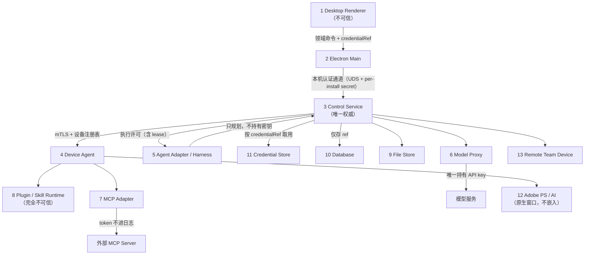

# D1-05 服务 / TLS / 存储 / 沙箱 / 执行隔离 技术验证

- 分支：`feature/d1-05-service-isolation`
- 基线提交：**`b39eb93ff90d0988b93684f21a1caf71cb272487`**（`docs(D1-02): 修正状态口径，区分任务状态与技术决策`）
- 结论：**PARTIAL（不是 COMPLETE）**
- 日期：2026-09-11

本轮回答的是一个问题：**OpenArc OS 有没有一条能真正落地、能真正验证的服务边界 / 设备连接 / 凭据保管 /
文件边界 / 代码执行路线。** 本轮**不建系统**：没有 `services/control`、没有 `services/device-agent`、
没有账号体系、没有数据库 schema、没有多人团队、没有完整插件中心。见 §29 未做清单。

---

## 0. 基线与范围

### 0.1 为什么是 `b39eb93`

- `b39eb93` 是 `feature/d1-02-harness` / `origin/feature/d1-02-harness` 的顶端。
- 它**包含** D1-01 的安全修复：`92a4522 D1-01: fix native view piercing desktop menu and persist window layout`、
  `34e6461 docs(D1-01): 修正三处推断强度，不改测试结果`。
- 它**不包含** D1-04 的 UI 提交（`65f4c4f`、`34dfff9`、`0a2f5d0`、`1bbfeac`、`b2fcd17`、`c15ee2d`、
  `bdcbba5`、`d1dfd00` 均不是它的祖先），也不包含 D1-03 的 Adobe 阻塞分支 —— 满足"不把 UI 混进安全分支、
  不合并 Adobe 阻塞分支"的要求。
- `git ls-tree b39eb93 docs/decisions/` 只有 `D1-01-desktop-native-view.md` 与 `D1-02-harness.md`。
  **D1-03 与 D1-04 的 ADR 不在本分支的树里**（它们分别存在于 `feature/d1-03-adobe` 与
  `feature/d1-04-design-performance`）。本轮对 D1-03 的处理方式：只借鉴其**结论方向**（Adobe 保持原生窗口
  外部连接、真实接入 ≠ 图标/表单/模拟结果），不引入其代码或分支内容。

### 0.2 读取的既有基线

`PLAN.md`（重点 §9、§13、§14、§15、§17、§26、§27、§28、§31、§32、§37、§38）、`PRODUCT.md`、
`PROGRESS.md`、`electron/main.cjs`、`electron/preload.cjs`、`electron/policy.cjs`、`package.json`，
以及本分支上可读的 D1-01 / D1-02 ADR。

---

## 1. 环境

| 项 | 值 |
| --- | --- |
| OS | macOS 26.6.2（Darwin 25.6.0） |
| 架构 | arm64（Apple M3 Pro，12 核） |
| Node | `v22.22.2`（`/Users/wepingli/.workbuddy/binaries/node/versions/22.22.2-3/bin/node`） |
| openssl | 3.5.0（支持 `-not_before` / `-not_after`，可真实签发过期证书） |
| 普通用户 | 仅 `wepingli` 一个（没有第二个可切换的 uid） |
| 背景负载 | loadavg 长期 8～10（非静默机器） |

### 环境的硬约束（直接影响本轮能验什么）

1. **Chromium sandbox 无法初始化**：必须 `--no-sandbox --disable-gpu-sandbox --in-process-gpu` 才能起进程。
2. **`/bin/ps` 被禁止执行**：它是 setuid root（`-rwsr-xr-x root wheel`），本环境一律返回
   `operation not permitted`。因此"密钥是否出现在进程表"改用自写的
   `sysctl(KERN_PROCARGS2)` 工具取证。
3. **seatbelt 只能套用"不增加限制"的 profile**：`(allow default)` 可以应用；一旦 profile 里出现任何
   `deny` 规则，`sandbox-exec` 返回 `sandbox_apply: Operation not permitted`。
   → **本机无法建立"进程级文件/网络沙箱"这一档 OS 约束。**
4. **`RLIMIT_AS` / `RLIMIT_DATA` / `RLIMIT_RSS` 在 macOS 上不可设**（`setrlimit` 返回 Invalid argument）。
   → 内存上限无法由 rlimit 强制。

第 3、4 条是本轮结论的天花板：它们把"OS 级隔离"这一档压成了 BLOCKED。

---

## 2. Trust Boundary

### 2.1 明确禁止的默认假设

**禁止"同一台机器上的进程都互相信任"。** 本机实测已证伪该假设：

- 任何**同 uid 进程**都可以直接连上 `127.0.0.1:<port>`（01 探针实测）。
- 任何**同 uid 进程**都可以读到另一个进程的**完整 argv 与环境块**，无需 root（03 探针实测，
  `sysctl KERN_PROCARGS2`）。
- 任何与本机主进程同 uid 的代码都可以直接 `fs.readFile()` 越过全部应用层路径检查（05 探针实测）。

因此：**同 uid = 不可信。** 信任只能来自显式握手、显式授权与 OS 级约束。

### 2.2 13 个实体

| # | 实体 | 谁信任它 | 明确不信任它的地方 | 可持有的凭据 | 可否产生副作用 | 可读的目录 |
| --- | --- | --- | --- | --- | --- | --- |
| 1 | Desktop Renderer | 不被信任（视为不可信输入源） | 不得持有任何真实密钥；不得直接调 shell / 文件系统 / 凭据库 | 仅 `credentialRef` | 否（只能发领域命令） | 无（只能经 IPC） |
| 2 | Electron Main | 被 Renderer 信任为唯一入口 | 不持有长期密钥；不解析业务语义 | 无（只转发 `credentialRef`） | 仅窗口/IPC 层 | 无业务目录 |
| 3 | Control Service | 本机内的唯一权威 | 不信任任何未带握手凭证的本机连接 | 团队模型配置（**不含个人密钥**） | 是（下发执行许可） | 仅工件目录 |
| 4 | Device Agent | 由 Control Service 经 mTLS 认证 | 不信任"已注册 ≠ 该设备上所有用户都有权限" | 设备私钥（不可导出） | 是（执行工具） | 仅授权工作区 |
| 5 | Agent Adapter / Harness | 由 Control Service 授权 | 不得自建第二套队列；不得偷偷重试工具；不得直接拿任意 shell | 无（凭 `credentialRef` 间接使用） | 否（只能规划） | 无 |
| 6 | Model Proxy | 由 Control Service 授权 | 不把原始 API key 下发给任何下游 | 模型 API key（唯一持有者） | 否 | 无 |
| 7 | MCP Adapter | 由 Device Agent 授权 | 不信任 MCP server 声明的权限；token 不进日志 | MCP token | 是（经工具） | 仅声明的目录 |
| 8 | Plugin / Skill Runtime | **完全不被信任** | 不得读取宿主文件、其他插件数据、原始凭据；不得联网（除非声明） | 无 | 是（受限） | 仅显式白名单 |
| 9 | File Store | 由 Control Service 授权 | 不做路径校验（由调用方在解析层收口） | 无 | 是（文件） | 工件目录 |
| 10 | Database | 由 Control Service 独占访问 | 不存明文凭据，只存 `credentialRef` | 无 | 是（状态） | 仅自身数据目录 |
| 11 | Credential Store | 由 Control Service 独占访问 | 不把明文交给 Renderer / 日志 / Harness / Skill | **全部密钥** | 否 | 仅自身 |
| 12 | Third-party App（Adobe PS / AI） | 由用户显式授权后建立通道 | 不信任它可以访问 OpenArc 的文件与凭据 | 自身的 Adobe 凭据（不由 OpenArc 转交） | 是（原生窗口内） | 自身可访问范围 |
| 13 | Remote Team Device | 由 Control Service 经 mTLS + 注册表认证 | 不信任"设备已注册"等于"操作者已授权" | 自己的设备私钥 | 是 | 自己工作区 |

### 2.3 信任图（数据与控制流）



---

## 3. Local IPC

### 3.1 三个候选 × 九个维度

| 维度 | A. Unix Domain Socket | B. localhost TCP | C. Electron IPC |
| --- | --- | --- | --- |
| 认证 | 需自建（UDS 本身不认证） | 需自建 | 由 `event.sender` / `senderFrame.url` 校验 |
| 端点可发现性 | 文件系统路径，可控（目录 0700 后同 uid 仍可见） | 端口可枚举，最容易发现 | 无网络端点，只在进程内 |
| 其他本机进程能否访问 | **能**（实测：另一进程无 token 也能 connect） | **能**（实测：直接 connect 成功） | 不能（不在 IPC 总线之外暴露） |
| 权限模型 | 目录 `0700` + 套接字 `0600`（内核强制） | **无任何文件系统 ACL**（实测） | Electron 内部 |
| 可移植性 | macOS / Linux 好；Windows 需 Named Pipe（ACL 语义不同） | 三端一致 | 仅 Electron |
| 生命周期 | 由文件是否存在决定，可残留 | 端口随进程释放 | 随窗口 |
| 崩溃恢复 | 需处理残留 socket 文件 | 自动 | 自动 |
| 调试 | 可用 `nc -U` 等 | 最方便 | 需 DevTools |
| 攻击面 | 最小（有 ACL 纵深） | 最大（同 uid 全可达） | 最小 |

### 3.2 实测结论（`01-local-ipc-probe`，12 PASS / 1 NOT VERIFIED）

- UDS 无 token → **DENY**；错 token → **DENY**；对 token → ALLOW。TCP 同样。
- **另一进程可直接 TCP 连上 127.0.0.1**，且**可以直接 connect 到 UDS**。
- TCP 侧确认**没有任何文件系统 ACL**；UDS 侧目录 `0700`、套接字 `0600` 已实测。
- 独立子进程的环境变量里不含 secret（token 只经 `0600` 文件交付，不落 env）。
- **未验证**：不同 uid 的进程是否被 UDS 权限挡住 —— 本机只有一个普通用户。

### 3.3 决策（Local IPC）

- **本机传输优先 UDS**（多一层内核 ACL 纵深），**但 UDS 不等于认证**。
- 认证必须自带：**per-install secret**（安装时生成、`0600` 保存、constant-time 比较）。
  验证码用 ``crypto.timingSafeEqual`` 且**先比长度**，避免长度侧信道。
- **`127.0.0.1` 不是认证手段**。任何"因为监听在 localhost 所以安全"的写法一律驳回。
- 调用链固定为：

  ```
  Renderer → 领域命令 → Electron Main / 本机认证服务 → 权限校验 → 执行边界
  ```

  **禁止** `Renderer → shell`、`Renderer → 无限制文件系统`、`Renderer → 凭据库明文`。
- Electron IPC 只作为" Renderer ↔ Main "这一段，`trusted(event)` 继续保留
  （`event.sender === win.webContents && event.senderFrame.url === uiURL`）。

---

## 4. LAN 拓扑

`local IPC` 与 `LAN RPC` **不是同一个安全边界**，禁止混用同一套假设：

| | Local | LAN |
| --- | --- | --- |
| 链路 | UDS / Named Pipe | TLS over TCP |
| 对端身份 | 本机同 uid 进程（**不可信**） | 设备证书（mTLS） |
| 认证 | per-install secret | 设备私钥 + 证书链 + 注册表 |
| 端点约束 | 文件权限位 | 网络可达性 + 证书 |
| 失败模式 | 连接被拒 | 握手失败（**不得降级明文**） |
| 重放防护 | 一次性 token | TLS 会话 + 应用层 callId 幂等 |

选定形态（本轮只冻结拓扑，不实现）：

```
桌面客户端 ──TLS/mTLS──> Control Service ──已认证设备通道──> Device Agent
```

---

## 5. TLS

### 5.1 做法

用 `openssl 3.5.0` 生成完整测试 PKI（CA + 第二个"错误的 CA" + 正常服务端证书 + 错误主机名证书 +
**真实过期**的服务端与客户端证书 + 伪造/过期客户端证书），在 `127.0.0.1` 上起一个 **TLS-only** 的
Control Service（`requestCert: true, rejectUnauthorized: true, minVersion: TLSv1.2`），
用独立客户端打 12 类场景。

### 5.2 实测结果（`02-tls-probe`，15 PASS）

| 场景 | 结果 |
| --- | --- |
| valid client + valid server | **ALLOW**（真实 TLS 握手） |
| 无客户端证书 | 握手失败 `ERR_SSL_PEER_DID_NOT_RETURN_A_CERTIFICATE` |
| 错 CA 签发的客户端证书 | **DENY** |
| 过期客户端证书 | **DENY**（`CERT_HAS_EXPIRED`） |
| 过期服务端证书 | 客户端拒绝服务端身份 |
| 主机名不匹配 | `ERR_TLS_CERT_ALTNAME_INVALID` |
| 撤销设备 | 证书链与有效期**仍然有效** → 必须应用层撤销；应用层命中后 **DENY** |
| 未注册设备（链有效） | **DENY**（`DEVICE_NOT_REGISTERED`） |
| 证书轮换 + 重连 | 旧证书被拒、新证书接受，**无需重启服务** |
| 明文 fallback | 裸 TCP 向 TLS 端口发明文 HTTP → 拿不到业务响应 |
| 证书 pinning | `getPeerCertificate().fingerprint256` 与 openssl SHA-256 指纹一致 |
| **总账** | 服务端被服务次数 **5 == 显式记账允许次数 5**；应用层拒绝 3、TLS 层拒绝 4 |

### 5.3 关键认知

- **mTLS 适合作为 Device Agent 的身份基础**：错误 CA、过期、主机名不匹配、无证书全部在握手期被拒。
- **Node 的 tls 不做 CRL / OCSP**：撤销与"是否已注册"必须在应用层实现，且实测表明
  证书链有效时握手会正常完成 —— 这条必须写进 D3 的设备管理设计。
- **任何"TLS 失败 → HTTP fallback"都是 FAIL**。本轮实测未触发，该项判 PASS。

---

## 6. Device Identity 与 User Identity

**用户身份 ≠ 设备身份。** 三条独立命题，不得互相代替：

1. 用户被授权 ≠ 任意一台电脑自动成为可信设备。
2. 设备被注册 ≠ 该设备上的所有用户都获得权限。
3. 设备在线 ≠ 设备当前的操作者是被授权的人。

因此 D3 必须保留四个**互相独立**的标识域：

| 标识 | 含义 | 生命周期 | 由谁签发 |
| --- | --- | --- | --- |
| `userId` | 用户身份 | 长期 | Control Service |
| `deviceId` | 设备身份（对应一张设备证书） | 绑定硬件安装，可吊销 | Control Service（注册时） |
| `sessionId` | 一次登录/一次通道会话 | 短期 | Control Service |
| `teamId` | 团队/空间 | 长期 | Control Service |

本轮**不做完整账号系统**，只冻结标识域划分，避免 D3 把 `deviceId` 当成 `userId` 用。

---

## 7. 凭据存储

### 7.1 被否决的路线：`/usr/bin/security` CLI

实测两条硬事实：

1. **CLI 的所有非交互形式都把密钥放进 argv**：
   - `security add-generic-password -a A -s S -U -w <明文> <kc>` → 用 `sysctl KERN_PROCARGS2`
     **实测抓到明文**出现在该进程的 argv 中。
   - `-X <hex>` 同样被抓到（hex 可解码回明文，安全性不比 `-w` 更好）。
   - Apple 自带帮助文本原文：`Use of the -p or -w options is insecure. Specify -w as the last option to be prompted.`
2. **CLI 会改写全局 Keychain 配置**：`create-keychain` 会把新库写进用户搜索列表；
   `default-keychain -d user -s <测试库>` 改写全局默认钥匙串。本次测量过程中，
   组合操作导致系统的 `login.keychain-db` 被重命名为 `login_renamed_1.keychain-db`，
   且批次命令被中断时还原步骤未执行。
   → 事后**已完整还原**：文件名改回、搜索列表与默认钥匙串复位、86 个通用密码条目可读、探针项无残留。
   该路线因此**否决**（`routeVerdict: REJECTED`）。

### 7.2 采用的路线：进程内 Security.framework

新写 `experiments/d1-05/native/keychain-helper.c`：一个通过 **stdin 行协议**驱动的常驻辅助进程，
内部直接调 `SecItemAdd` / `SecItemCopyMatching` / `SecItemDelete`。密钥**只经 stdin 管道**进入，
不进 argv、不进 env、不落磁盘明文。

实测（`03-credential-probe`，30 PASS / 2 NOT VERIFIED）：

| 检查 | 结果 |
| --- | --- |
| 写入假密钥并回读，字节完全一致 | PASS |
| helper 进程 argv 里没有明文 | PASS（`KERN_PROCARGS2` 实测） |
| helper 子进程环境 = `["PATH"]`，未继承父进程全量 env | PASS（读真实环境块） |
| `artifacts/d1-05` 全树扫描无明文 | PASS |
| `login.keychain-db` 字节流中无明文 | PASS |
| `dump-keychain` 可见属性中无明文 | PASS |
| 删除后无法读回 | PASS |
| 全局 Keychain 状态与探针前一致 | PASS |
| Windows DPAPI / Credential Manager | **NOT VERIFIED** |

### 7.3 决策（凭据存储）

- 生产实现走**进程内 API**（Electron `safeStorage` 或 Security.framework 绑定），
  **禁止 shell out 到 `/usr/bin/security`**。
- Windows 侧 DPAPI / Credential Manager **必须真机验证**，不得用 macOS 结论外推。

---

## 8. Secret Boundary（密钥边界）

真实密钥**不得**进入以下任何位置：

| 位置 | 规则 |
| --- | --- |
| Desktop Renderer | 只能拿到 `credentialRef`，永不拿明文 |
| localStorage / IndexedDB | 只存 UI 偏好（实测键：`oa-dark`、`oa-motion`、`oa-opaque`、`oa-folders`、`oa-wins`）；密钥只允许存"加密后的引用"，且必须单独评审 |
| Harness prompt / memory | 明文不得出现在提示与记忆中 |
| Skill 包 / Plugin 导出 | 不得携带密钥（PLAN §28 已有导出禁项） |
| Git | 不得入库 |
| 普通日志 | 见 §18 |
| 崩溃报告 | 见 §18 / §21 |
| 子进程 env | 见 §9 |

已实现并实测的封装原型 `experiments/d1-05/lib/credential-store.mjs`：

- `put()` 只返回 `credentialRef`（形如 `cred://<owner>/<name>#<8hex>`），**不含明文**（深扫验证）。
- `list()` 是面向 Renderer 的视图，只有 `ref / owner / name`。
- `use(ref, fn)` 把明文交给执行边界内的回调，自身不返回明文。
- `del(ref)` 之后 ref 失效，无法读回。
- 代码面审计：`preload.cjs` 暴露面（`navigate / layout / action / onBrowser / onDisplay`）无凭据类成员；
  主进程 IPC 通道只有 `browser:navigate / browser:layout / browser:action`，无凭据通道。

---

## 9. Environment Isolation（环境继承）

这是本轮**最容易被忽略、但实测风险最高**的一条。

实测（`04-env-probe`，9 PASS）—— 在父进程环境里放 4 个假密钥，然后从子进程的**真实环境块**读：

| 启动写法 | 子进程看到的密钥数 |
| --- | --- |
| 不传 `env` 选项（默认继承） | **4 / 4 全部泄漏** |
| `env: { ...process.env }` | **4 / 4 全部泄漏** |
| `env: { PATH, HOME }`（显式允许列表） | **0** |
| `env: {}` | 0，但 macOS 仍会注入 `__CF_USER_TEXT_ENCODING`（`KERN_PROCARGS2` 还能看到 dyld 的 `ptr_munge`） |

四种执行单元形态（Harness / Plugin / Skill worker / Device tool）在默认写法下**暴露完全一致**，
不存在"某个执行单元碰巧安全"。

**Worker Thread**：与主线程**共享同一个 `process.env`**，在 worker 里能读到全部密钥（实测）。

### 决策

- **禁止 `{ ...process.env }`，也禁止"不传 env 选项"** 进入生产代码。
- 所有执行单元启动必须走**显式环境允许列表**（最少 `PATH`，按需 `HOME` / `LANG`）。
- 在 Device Agent / Harness 的**启动层做一处收口**，不靠各调用点自觉。
- 凭据只经 `credentialRef` 在执行边界内解析，绝不落进 env。
- "清空 env"不是方案：既做不到真正为空，也会让子进程丢掉 `PATH` / `HOME` / `LANG`。

---

## 10. File Boundary（文件边界）

### 10.1 常见写法直接被攻破

`path.resolve(base, p)` + `abs.startsWith(base)` —— 实测被以下载荷放行并**泄漏受限内容**：

- `../allowed-evil/evil.txt`（**同前缀目录混淆**，`startsWith` 天然会中招）
- `escape-file` / `escape-dir/secret.txt` / `notes.txt` / `n1/n2/secret.txt`（各类软链）

### 10.2 加固实现的边界

加固写法 = 词法边界用 `path.relative`（而非 `startsWith`）+ 对"最长已存在祖先"做 `realpath`
+ 末段用 `O_NOFOLLOW` 打开。实测结果：

| 载荷 | 结果 |
| --- | --- |
| `../denied/secret.txt` / `./../…` / `n2dir/../../…` | **DENY** |
| 绝对路径 `/etc/hosts` | **DENY**（`ABSOLUTE_PATH`） |
| 前缀混淆 `../allowed-evil/evil.txt` | **DENY** |
| `%2e%2e%2f…`（未解码） | DENY（当作普通文件名，不存在）；**解码后的形态才是威胁，已 DENY** |
| `ok.txt\0../denied/secret.txt` | **DENY**（`NUL_BYTE`） |
| 软链：普通 / 目录 / 改名 / 嵌套 | **全部 DENY**（`SYMLINK_ESCAPE`） |
| 正常相对路径 | ALLOW |

### 10.3 加固实现挡不住的两件事（已实测）

1. **硬链接**：`allowed/innocent.txt` 与 `denied/secret.txt` 同 inode，路径完全合法 → **放行**。
   路径检查只能判断"路径"，判断不了"内容归属"。
2. **TOCTOU 中间段替换**：检查时 `allowed/swapdir` 是真目录，检查之后被换成指向 `denied` 的软链，
   `open(checked)` 顺着软链走到 `denied/` → **实测读到受限内容**。
   `O_NOFOLLOW` 只保护**最后一个**路径段。
   对照：末段被替换时 `O_NOFOLLOW` 确实返回 **ELOOP**（TOCTOU-1 PASS）。

### 10.4 执行单元一旦拥有 `fs`，全部路径检查失效

实测：同进程内直接 `fs.readFileSync("<denied>/secret.txt")` → **读到受限内容**。
因为**根本没有经过那个函数**。

> **结论：应用层路径检查只在"I/O 必须经过该函数"时才有效；一旦执行单元拿到 `fs`，
> 它只是"防呆"，不是安全边界。安全边界必须由 OS 提供。**

### 10.5 工作目录边界

`cwd` 必须来自已授权 `workspaceRef`，与文件授权**共用同一套加固解析**。实测：

- 绝对路径 `/Users/wepingli`、`/` → **DENY**
- `../..` 逃出工作区 → **DENY**
- 伪造 `workspaceRef` → **DENY**（`UNKNOWN_WORKSPACE_REF`）
- `~` / `~/` → 作为普通名字被限制在工作区内（Node 不展开 `~`）；
  真正让 `~` 生效的是把它交给 shell，而 shell 执行已被 §14 禁止

---

## 11. Symlink / Traversal 汇总

见 §10.2 / §10.3。要点：**静态场景可以防住；动态场景（TOCTOU 中间段、硬链接）防不住。**
这两条只能靠 OS 层（逐段 `openat` + `O_NOFOLLOW`，或进程级沙箱 / 最小权限账号）。

---

## 12. Plugin / Skill Isolation（执行模型对比）

| 维度 | A 同进程 | B Worker Thread | C 子进程 | D OS 沙箱子进程 |
| --- | --- | --- | --- | --- |
| 崩溃隔离 | **无**（插件崩溃 = 宿主崩溃，实测） | 有（宿主存活，实测） | 有（实测） | 有 |
| 内存隔离 | 无 | **无**（共享地址空间，`SharedArrayBuffer` 实测可互通） | 有 | 有 |
| 文件系统 | 无约束 | 无约束（等同同进程） | **无约束**（实测可读受限目录） | **本机无法建立（BLOCKED）** |
| 网络 | 无约束 | 无约束 | 无约束 | **本机无法建立（BLOCKED）** |
| 环境 | 完全共享 | 完全共享（实测） | 可控（需显式允许列表） | 可控 |
| 取消 | 只能协作式中止 | `terminate()` | `kill`（需处理孙进程） | `kill` + 进程组 |
| 资源限制 | 无独立配额 | `resourceLimits`（只覆盖 V8 堆） | rlimit（部分可用） | rlimit（部分可用） |
| 可调试性 | 最容易 | 中等 | 中等 | 较难 |

### 决策

- **Worker Thread 不是安全边界** —— 它连"环境隔离"都没有，且共享地址空间。只用来"不卡住主线程"。
- **Child Process 单独也不是沙箱** —— 实测它对文件系统与网络毫无约束。
- 只有**"子进程 + OS 级沙箱（或最小权限账号）"**才可能构成执行边界；
  **但该档在本机 BLOCKED**，必须写成"未取得证据"。
- Windows 对应能力（Job Object / AppContainer / Restricted Token）全部 **NOT VERIFIED**。

---

## 13. Process Execution

- 默认 **`shell = false`**；一律 `spawn(executable, args)`；**禁止 `exec(用户字符串)`**。
- 实测见 §14。

---

## 14. Shell Policy

7 类注入载荷：`;`、`&&`、`|`、反引号、`$(...)`、引号闭合、换行（载荷效果 = 创建标记文件）。

| 写法 | 结果 |
| --- | --- |
| `spawn("/bin/echo", [payload])`，`shell: false` | **7 / 7 标记文件均未创建**（载荷整体是一个 argv） |
| `/bin/sh -c "echo " + payload` | **有若干载荷真的执行了**（反例实测） |

> 反例被同时实测，说明"禁止 `exec(用户字符串)`"是**必须的工程约束而不是教条**。

**注意一个真实陷阱**：注入实验最初把标记文件放在带空格的路径下，shell 拼接把路径切碎，
得到"看起来没被注入"的**假阴性**。取证设计本身也会骗人。

---

## 15. Command Allowlist

正式接口形态（已实现为原型并逐条实测，12/12 符合预期）：

```js
executeTool({ toolId, args, cwdRef, credentialRefs })
```

`Tool ID → 已批准可执行文件 → 已批准参数 schema`：

| 调用 | 结果 |
| --- | --- |
| 合法 `file.read` | ALLOW → `/bin/cat ["<workspace>/allowed/ok.txt"]` |
| 未知 `toolId` | **DENY**（`UNKNOWN_TOOL_ID`） |
| 调用方自带可执行文件 | **DENY**（`EXE_OVERRIDE_FORBIDDEN`） |
| 参数不在 schema 内 | **DENY**（`ARG_NOT_IN_SCHEMA`） |
| 参数类型不符 | **DENY**（`ARG_TYPE_MISMATCH`） |
| 缺必填参数 | **DENY**（`MISSING_REQUIRED_ARG`） |
| 用 `path` 做穿越 | **DENY**（`CWD_OUTSIDE_WORKSPACE`） |
| 参数里塞 shell 元字符 | ALLOW（作为**单个 argv** 传入，`/usr/bin/grep ["-n","--","x; /usr/bin/touch /tmp/pwn", …]`） |
| 要求未授权的 `credentialRef` | **DENY**（`UNKNOWN_CREDENTIAL_REF`） |
| 给不允许 cwd 的工具传 `cwdRef` | **DENY** |
| `cwdRef` 指向绝对路径 | **DENY**（`ABSOLUTE_CWD`） |
| 给 `model.call` 传其被授权的 ref | ALLOW |

> **Harness 拿不到任意 shell。** 可执行文件由注册表决定，调用方**不能**指定。

---

## 16. Network Policy

本轮只**冻结模型**，不做插件中心：

| 档位 | 含义 |
| --- | --- |
| `network: none` | 默认档，执行单元不得建立任何出站连接 |
| `network: selected-hosts` | 仅允许白名单主机/端口，需在 OS 层或经审计的本地代理强制 |
| `network: unrestricted` | 仅对明确声明的工具开放，必须在安装与执行时可见 |

**"无网络权限的执行单元不得建立出站连接"这一条的实测状态：BLOCKED。**

原因：本机无法应用带 `deny network*` 的 seatbelt profile。因此**没有**在真实 OS 层构造出
"无网络权限的执行单元"。明确**不接受**以下替代：

- 用 JS 里 patch `fetch` / `net.connect` 冒充网络沙箱（改一行代码就绕过，不是边界）；
- 用 hosts 或防火墙规则代替（无法在探针内可复现地开关）。

Windows 侧未验证。

---

## 17. Resource Limits

| 资源 | 机制 | 实测 |
| --- | --- | --- |
| CPU 时间 | `RLIMIT_CPU` | **生效**：死循环被内核以 **SIGXCPU** 终结 |
| 单文件写入 | `RLIMIT_FSIZE` | **生效**：4MB 写入被截断，文件正好等于上限 65536 字节 |
| 进程/线程数 | `RLIMIT_NPROC` | **生效**：超限 fork 被拒（EAGAIN） |
| 墙钟挂起 | 服务端计时 + `SIGKILL` | **生效**：`sleep` 不耗 CPU，CPU 限制抓不到它，必须靠墙钟超时 |
| stdout 体积 | 服务端读取上限 | **生效**：子进程输出 64MB，服务端在 1MB 处强杀（实测读到 1179648 字节） |
| **内存** | `RLIMIT_AS / DATA / RSS` | **BLOCKED**：macOS 上 `setrlimit` 直接失败（Invalid argument） |
| 内存（退路） | V8 `Worker.resourceLimits` | **PARTIAL**：能约束 V8 堆并抛 `ERR_WORKER_OUT_OF_MEMORY`；**但约束不了堆外内存** |

**一条事故级发现**：`maxOldGenerationSizeMb: 16` 之下，Worker 仍成功分配了 **256MB Buffer**。
`Buffer` / `ArrayBuffer` 走 V8 堆**外**（external）内存，完全不受堆上限约束。
首轮探针运行因此把探针进程本身拖到被 **OOM 杀掉（exit 137）**。

> **结论：内存限制不能只靠运行时。** macOS 上 rlimit 路线不可用，
> V8 堆上限又覆盖不到堆外，必须由 OS 层（Windows Job Object `ProcessMemoryLimit`、
> macOS memorystatus / Jetsam、Linux cgroup）兜底。

---

## 18. Cancellation

实测（`07-exec-probe`）：

| 做法 | 结果 |
| --- | --- |
| 只 `kill` 直接子进程 | 孙进程**成为孤儿并继续存活**（实测） |
| `kill(-pgid)`（进程组） | parent → child → grandchild **全部退出，无孤儿**（实测） |

- 强制流向：`STOP` → 取消传播 → **进程组 SIGTERM** → 超时未退则 **SIGKILL**。
- 取消延迟实测在数十毫秒量级。
- 另注：**被信号杀死时退出码为 `null`**，必须同时记录 `signal`；
  否则"被内核限制"与"正常失败"在日志里无法区分。
- **Windows：NOT VERIFIED** —— 对应机制是 Job Object / 控制台进程组，语义必须真机验证。

---

## 19. Logging / Redaction

### 19.1 日志规则

**允许**：`taskId`、`callId`、`toolId`、`status`、`durationMs`、`errorCategory`、`attempt`、
`deviceRef`、`workspaceRef`。

**默认禁止**：API key、`Authorization` 头、MCP token、文件内容、用户 prompt 全文（除非显式策略）、
不必要的私有路径。

### 19.2 实现要点（已实测，10 PASS）

- **字段白名单而非黑名单**：多塞一个未登记字段（例如 `prompt`）→ **直接拒绝写入**，
  而不是"静默记下来"。
- 脱敏覆盖 7 种隐蔽形态：字段值直接是密钥、`Authorization: Bearer …`、
  URL 查询参数 `?api_key=…`、MCP token、Adobe 凭据、**base64 编码后的密钥**、**私有绝对路径**。
  → 单靠"匹配 `sk-` 前缀"是不够的，长随机串规则必须同时存在。
- 落盘日志文件扫描：**无任何登记的密钥明文**。

### 19.3 一个实现陷阱（已记录）

正则**没有捕获组**时，`String.replace` 回调的第二个参数是**匹配偏移量**而不是分组。
早期版本因此把偏移数字当"前缀"输出了。修法：为每条规则显式标注 `keep: 0 | 1`，
不靠回调参数位置判断。

---

## 20. Side-effect Uncertainty（副作用不确定性）

**这是 D4 的前置安全基础。** 契约（本轮只写契约，不实现完整任务系统）：

状态集合：`PENDING / RUNNING / COMPLETED / FAILED / UNKNOWN_EFFECT / CANCELLED`

硬规则：

1. **结果上报丢失（执行端已开始产生副作用）→ `UNKNOWN_EFFECT`，不是 `FAILED`。**
2. **`UNKNOWN_EFFECT` 不允许直接 `RETRY`**，必须先 `VERIFY`。
3. 有副作用的工具在 `FAILED` 且 `uncertainSideEffect = true` 时，同样必须先 `VERIFY`。
4. `CANCELLED` 对有副作用的工具同样视为"可能已生效"。
5. 无副作用的纯读调用才允许直接 `RETRY`。

核对流程（三支闭环）：

| 核对结果 | 下一状态 | 下一步 |
| --- | --- | --- |
| 副作用已生效 | `COMPLETED` | 上报结果 |
| 副作用未生效 | `FAILED` | 允许重试 |
| **无法判定** | **`UNKNOWN_EFFECT`** | **转人工** |

> 无法判定时必须停在 `UNKNOWN_EFFECT`，既**不能显示成功**，也**不能"安全重试"** ——
> 因为无法证明重试是安全的。

另需落盘：执行端在**产生副作用之前**先记录 `callId` 与"已开始"状态，然后保存结果摘要与工件引用；
重复上报不得造成第二次执行。

实测：6 个状态组合全部给出预期答案，`UNKNOWN_EFFECT` 状态下**不存在任何允许 `RETRY` 的路径**。

---

## 21. macOS Verification

| 项 | 状态 |
| --- | --- |
| TLS / mTLS 握手与失败矩阵 | **PASS**（15/15） |
| 本机认证（UDS / TCP / token） | **PASS**（12 PASS，1 NOT VERIFIED） |
| Keychain 读写删与密钥边界 | **PASS**（30 PASS，2 NOT VERIFIED） |
| 环境继承与允许列表 | **PASS**（9/9） |
| 路径 / 软链 / TOCTOU / 工作目录 | **PASS**（8/8，其中 2 条是"挡不住"的实测） |
| 日志脱敏 / 错误边界 / 副作用契约 | **PASS**（10/10） |
| 崩溃隔离 / 内存共享 | **PASS** |
| shell 策略 / 命令允许列表 | **PASS** |
| CPU / 文件体积 / 进程数限制 | **PASS**（内核强制） |
| 取消传播与孤儿检查 | **PASS** |
| **OS 级文件与网络沙箱** | **BLOCKED** |
| **内存上限** | **BLOCKED**（rlimit 不可设） |
| 跨 uid 的 UDS 权限拦截 | **NOT VERIFIED**（只有一个普通用户） |

---

## 22. Windows Status

**全部 NOT VERIFIED。** 无 Windows 主机。**不得因为 Node API 名字相同就认为隔离成立**，
以下每一项都必须在真机 PASS：

- DPAPI / Credential Manager（凭据存储）
- Named Pipe ACL（本机端点访问控制）
- Job Object（进程组取消、`ProcessMemoryLimit`、`ActiveProcessLimit`）
- AppContainer / Restricted Token（文件与网络约束）
- Windows 沙箱行为
- 进程组语义与孤儿回收

---

## 23. Attack Matrix（12 条）

| # | 攻击 | 期望 | 实测 | 判定 |
| --- | --- | --- | --- | --- |
| 1 | 未认证的本地请求 | DENY | 同 uid 进程能连上 UDS/TCP，但无 token / 错 token 一律 DENY | **PASS** |
| 2 | 伪造设备 | DENY | 错 CA / 无证书 / 链有效但未注册，全部被拒 | **PASS** |
| 3 | 错误 TLS 证书 | DENY | 错 CA DENY；主机名不匹配被客户端拒；明文 HTTP 拿不到业务响应 | **PASS** |
| 4 | 过期证书 | DENY | 真实签发的过期证书被拒（客户端与服务端两侧都测） | **PASS** |
| 5 | 路径穿越 | DENY | 加固实现对 13 类载荷全 DENY；**但中间段 TOCTOU 与硬链接可绕过** | **PARTIAL** |
| 6 | 软链逃逸 | DENY | 静态软链全 DENY（含改名/嵌套）；**中间段替换与硬链接可绕过** | **PARTIAL** |
| 7 | 任意 shell 注入 | DENY | 7 类载荷在 `shell:false` 下全部无效；反例同时被实测 | **PASS** |
| 8 | 插件读取受限目录 | DENY | 同进程与普通子进程均可读；**本机无法建立 OS 级文件约束** | **BLOCKED** |
| 9 | 插件看到父进程密钥 | DENY | 默认写法泄漏 4/4；允许列表泄漏 0；**Worker 档无解** | **PARTIAL** |
| 10 | 日志里出现密钥 | DENY | 白名单拒字段 + 7 形态脱敏 + 落盘扫描无命中 | **PASS** |
| 11 | 取消后出现孤儿 | NONE | 只杀一层会留孤儿；按进程组取消无孤儿 | **PASS** |
| 12 | 未知副作用 | VERIFY，不盲目重试 | 契约闭环，无允许盲目重放的路径 | **PASS** |

**硬红线（触发即 FAIL）**：TLS 失败降级到明文 / 任意 shell 注入被执行 / 未知副作用被盲目重放。
**三条均未被触发。**

**合计**：PASS 8、PARTIAL 3、BLOCKED 1、FAIL 0。

---

## 24. Decisions

1. **同 uid 不等于可信。** 本机所有进程默认互不信任；信任只来自显式握手、显式授权与 OS 约束。
2. **本机传输用 UDS + per-install secret**，`timingSafeEqual` 比较（先比长度）。
   **`127.0.0.1` 不构成认证。**
3. **调用链固定**：`Renderer → 领域命令 → Main / 本机认证服务 → 权限 → 执行边界`。
   禁止 `Renderer → shell`、`Renderer → 无限制 fs`、`Renderer → 凭据明文`。
4. **Device Agent 身份用 mTLS**；**撤销与注册表必须自建**（Node tls 无 CRL/OCSP）。
5. **禁止 TLS 失败降级明文**；任何 fallback 一律 FAIL。
6. **四个标识域独立**：`userId` / `deviceId` / `sessionId` / `teamId`。
7. **凭据存储走进程内 API**；禁止 shell out 到 `/usr/bin/security`（密钥会进 argv，且会改写全局钥匙串配置）。
8. **Renderer 只拿 `credentialRef`**，永不拿明文；密钥不入 localStorage / IndexedDB / prompt / Skill 包 / Git / 日志 / 崩溃报告。
9. **执行单元启动必须用显式环境允许列表**；禁止 `{ ...process.env }` 与"不传 env 选项"。
10. **应用层路径检查不是安全边界**：`path.resolve` 只能用于"防呆"，且必须用 `path.relative` 判断边界
    （`startsWith` 会被同前缀目录骗过）。`cwd` 必须来自 `workspaceRef` 并共用同一套解析。
11. **禁止在路径检查上宣称安全性**：硬链接与 TOCTOU 中间段已被实测绕过。真正的边界只能来自 OS 层。
12. **插件 / Skill 执行按"子进程 + OS 沙箱"设计**；Worker Thread 只用于不阻塞主线程，不作为隔离手段。
13. **`shell = false`，`spawn(executable, args)`**；禁止 `exec(用户字符串)`。
14. **命令允许列表**：`executeTool({ toolId, args, cwdRef, credentialRefs })`，
    可执行文件与参数形状由工具注册表决定，调用方不能指定命令。
15. **网络三档模型**：`none`（默认）/ `selected-hosts` / `unrestricted`；
    强制点必须在 OS 层或经审计的本地代理，**禁止用 JS patch 冒充**。
16. **资源限制**：CPU / 文件体积 / 进程数由内核强制；**内存必须由 OS 层兜底**（V8 堆上限覆盖不到堆外）；
    stdout 与墙钟超时由服务端强制；**退出上报必须同时记录 `signal` 与 `actualFileSize`**
    （否则"被静默截断"会被漏掉）。
17. **取消按进程组**（`kill(-pgid)`），SIGTERM → 超时 → SIGKILL；取消后必须核对无孤儿。
18. **日志字段白名单**；多塞字段直接拒绝写入；脱敏必须覆盖 base64 与私有路径。
19. **错误边界**只放行：用户可读文案 + 机器码（固定枚举）+ `retryable` + `uncertainSideEffect`；
    stack / env / Authorization / 私有绝对路径一律不外泄。
20. **`UNKNOWN_EFFECT` 契约**：结果上报丢失不得判 `FAILED`；任何"副作用可能已发生"的状态
    都不得直接重试；无法判定时转人工。

---

## 25. Risks

| 风险 | 说明 | 影响 |
| --- | --- | --- |
| **应用层隔离被当成安全边界** | 05 / 06 已实测：路径检查可绕过、子进程无文件约束。若 D2/D3 把它当边界，会形成"看起来有隔离"的假象 | 高 |
| **macOS 内存上限无 OS 手段** | rlimit 不可设、V8 堆上限不覆盖堆外，实测把进程拖到 OOM 被杀 | 高 |
| **Windows 全未验证** | 所有 Windows 侧隔离机制都是空白 | 高 |
| **mTLS 无 CRL/OCSP** | 撤销必须自建，容易漏做 | 中 |
| **默认 env 继承** | 默认写法会把主进程全部密钥送进每个执行单元 | 高 |
| **假阴性风险** | 注入实验中"带空格路径"曾造成"看起来没被注入"的假阴性；取证设计本身需要复核 | 中 |
| **`security` CLI 的全局副作用** | 实测导致 login keychain 被重命名；任何脚本化凭据操作都有此类风险 | 中 |
| **放弃权限后的还原** | 本轮出现过一次全局 Keychain 配置被改动，虽已完整还原，但说明"探针也会改机器状态" | 中 |

---

## 26. Remaining Blockers

1. **OS 级进程沙箱（macOS seatbelt）BLOCKED**：本环境无法应用带 `deny` 规则的 profile。
   需要在**不受限的机器 / 普通终端**上重跑 06，或改用最小权限账号（需第二个 uid / sudo）。
2. **内存上限 BLOCKED**：macOS rlimit 不可设；需要评估 memorystatus / Jetsam 或引入受限运行时的方案。
3. **跨 uid 的 UDS 权限拦截 NOT VERIFIED**：需要第二账号或 `sudo`。
4. **Windows 全项 NOT VERIFIED**：需要一台 Windows 主机。
5. **网络沙箱 BLOCKED**：依赖第 1 条解决。
6. **Electron `safeStorage` 端到端未测**：本轮用 Security.framework 原生原型完成等效验证，
   `safeStorage` 的可用性（是否依赖签名/打包形态）需要在真实打包后的应用里补测。

---

## 27. Evidence

### 27.1 探针与产物

| 探针 | 覆盖章节 | 产物 | 判定 |
| --- | --- | --- | --- |
| `experiments/d1-05/01-local-ipc-probe.mjs` | §3、§23#1 | `artifacts/d1-05/01-local-ipc.json` | PASS（12 / NV 1） |
| `experiments/d1-05/02-tls-probe.mjs` | §5、§6、§23#2~4 | `artifacts/d1-05/02-tls.json`、`02-tls-handshake-log.json` | PASS（15） |
| `experiments/d1-05/03-credential-probe.mjs` | §7、§8、§19 | `artifacts/d1-05/03-credential.json` | PASS（30 / NV 2） |
| `experiments/d1-05/04-env-probe.mjs` | §9、§23#9 | `artifacts/d1-05/04-env.json` | PASS（9） |
| `experiments/d1-05/05-path-probe.mjs` | §10、§11、§23#5~6 | `artifacts/d1-05/05-path.json` | PASS（8） |
| `experiments/d1-05/06-isolation-probe.mjs` | §12、§16、§23#8 | `artifacts/d1-05/06-isolation.json` | **PARTIAL**（9 / BLOCKED 2 / PARTIAL 1） |
| `experiments/d1-05/07-exec-probe.mjs` | §13~15、§17、§18、§23#7/#11 | `artifacts/d1-05/07-exec.json` | **PARTIAL**（13 / PARTIAL 2 / BLOCKED 1） |
| `experiments/d1-05/08-redaction-probe.mjs` | §19、§20、§23#10/#12 | `artifacts/d1-05/08-redaction.json` | PASS（10） |
| `experiments/d1-05/09-attack-matrix.mjs` | §23 | `artifacts/d1-05/09-attack-matrix.json` | **PARTIAL**（12 / PARTIAL 5 / BLOCKED 1） |

### 27.2 支撑代码

- `experiments/d1-05/lib/probe.mjs` —— 共用探针框架（结论口径、环境采集、假密钥、
  磁盘明文搜索、**产物写盘前强制脱敏**）。
- `experiments/d1-05/lib/credential-store.mjs` —— 凭据封装原型（`credentialRef` 边界）。
- `experiments/d1-05/gen-test-certs.sh` —— 测试 PKI 生成（含真实过期证书）。
- `experiments/d1-05/native/keychain-helper.c` —— 进程内 Security.framework 凭据存取。
- `experiments/d1-05/native/argvpeek.c` —— `sysctl(KERN_PROCARGS2)` 的 argv/env 取证工具
  （替代被禁用的 `/bin/ps`）。
- `experiments/d1-05/native/rlimit-exec.c` —— 内核级资源限制包装器。
- `experiments/d1-05/run-all.mjs` —— 一键复现全部探针。

### 27.3 复现命令

```bash
# 需要在不带限制的终端里执行（/usr/bin/security 需读写钥匙串；部分取证依赖 KERN_PROCARGS2）
cd "/Users/wepingli/Desktop/OpenArc OS"
node experiments/d1-05/run-all.mjs
```

单独复现某一条：

```bash
node experiments/d1-05/05-path-probe.mjs   # 穿越 / 软链 / TOCTOU
node experiments/d1-05/06-isolation-probe.mjs  # 依赖 05 先建好 sandbox 布局
```

### 27.4 已知环境残留（已清理）

- `artifacts/d1-05/` 为 gitignored 的取证目录，含测试证书、测试钥匙串残留（已删）、
  注入实验目录（已清）、临时日志。
- 一次测量事故导致 `~/Library/Keychains/login.keychain-db` 被系统重命名，
  **已改回原名并复位搜索列表与默认钥匙串**，86 个通用密码条目可读。详见 §7.1。

---

## 28. 未做清单（§29 约束）

本轮**没有**、也不应该开始以下内容：

- 未创建 `services/control`（Control Service 只有"TLS-only 探针服务"这一形态）
- 未创建 `services/device-agent`
- 未做账号体系 / 登录 / 注册 / 邀请
- 未做数据库 schema、未做迁移
- 未做多人团队与权限矩阵实现
- 未做完整插件中心（只做了工具注册表与资源限制的最小原型）
- 未改 `electron/main.cjs` 的产品行为（安全审计是只读的）

本轮新增的都是**探针、原生取证小工具与一个凭据封装原型**。

---

## 29. D1-05 通过条件自查（对照任务书 §31）

| 通过条件 | 状态 |
| --- | --- |
| 本机服务边界清晰 | ✅ UDS + per-install secret；"localhost 不是认证"已实测 |
| LAN TLS 路线真实握手 | ✅ 12 类场景实测，无明文降级 |
| 凭据不进入 Renderer / 普通日志 | ✅ 原型边界 + 静态审计 + 落盘扫描 |
| 子进程密钥继承受控 | ✅ 默认泄漏已实测，允许列表泄漏 0 |
| 路径穿越被拒 | ⚠️ 加固实现全 DENY，但存在已实测绕过（硬链接、TOCTOU 中间段） |
| 软链逃逸被拒 | ⚠️ 静态场景 DENY，动态场景被绕过 |
| 任意 shell 注入被拒 | ✅ 7 类载荷实测无效 |
| 取消不留已知孤儿 | ✅ 按进程组取消实测无孤儿 |
| 副作用未知不允许盲目重试 | ✅ 契约闭环 |
| OS 沙箱能力明确区分 VERIFIED / NOT VERIFIED | ✅ 明确标注 BLOCKED |
| Windows 未测清晰标注 | ✅ 全项 NOT VERIFIED |

**判定：PARTIAL。**

理由（直引任务书 §31）：

> **如果核心安全边界只有 JS 逻辑、没有 OS 级约束，不能写 COMPLETE。**

本轮的核心 OS 级约束（进程级文件与网络沙箱、内存上限）在本机 **BLOCKED**，
现有拦截中确有相当一部分是 JS 逻辑（且已被实测绕过）。
因此 D1-05 **不得判 PASS / COMPLETE**，也不得进入 D1-06。

**下一轮（D1-06）之前必须解决的前置**：见 §26 Remaining Blockers。
